# COMPARACIÓN DE TECNOLOGÍA CMOS y TTL
| Electrónica Digital I | Grupo 4 | Equipo 3 |
|------------------------|---------|----------|

- Nicolás Garzón Peña
- José Alejandro López Vargas
- Johan Stiven Tovar López
___

En la electrónica digital, las tecnologías TTL y CMOS destacan por sus características y aplicaciones. Este informe se enfoca en comparar estos negadores mediante el análisis de parámetros clave, como tiempos de respuesta, niveles de tensión y disipación de potencia, utilizando, en primer lugar, los valores nominales proporcionados en los datasheets, luego simulaciones en Qucs y finalmente comparando estos datos con las mediciones experimentales.

# Especificaciones técnicas

En esencia, los dos **negadores** a utilizar son puertas lógicas que invierten el valor de su entrada: si recibe un `1`, entrega un `0`, y viceversa. Es un pilar para formar otras compuertas lógicas.  

 | Entrada (A) | Salida (¬A) |
|-------------|-------------|
| 0           | 1           |
| 1           | 0           |

Sin embargo, estas salidas y entradas están situadas dentro de intervalos de voltaje especificos en cada tecnología, cómo se vera posteriormente.

## Negador TTL 74LS04
Los **TTL (Transistor-Transistor Logic):** se usan en sistemas de alta velocidad, como computadoras y controladores industriales. Su hoja de especificaciones es:

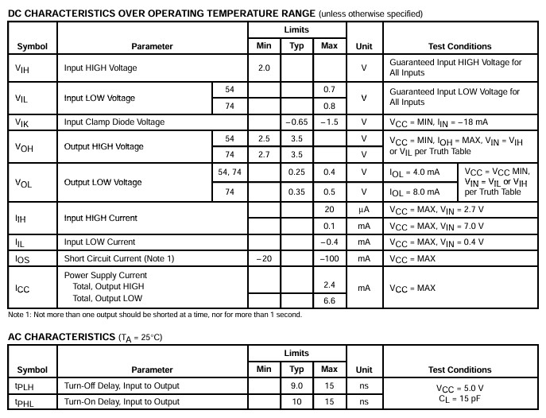

Además, el circuito equivalente dado en los datasheets del dispositivo es:

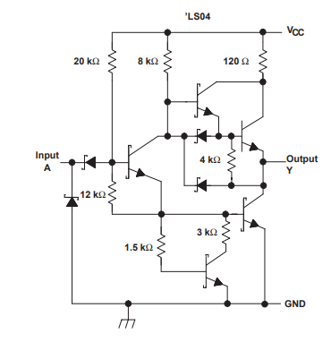

## Negador CMOS CD4069
Los **CMOS (Complementary Metal-Oxide-Semiconductor):** Ideal para dispositivos de bajo consumo, como celulares y sensores portátiles. Su hoja de especificaciones es:

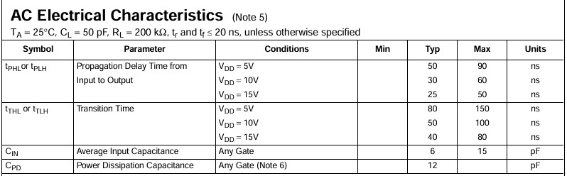

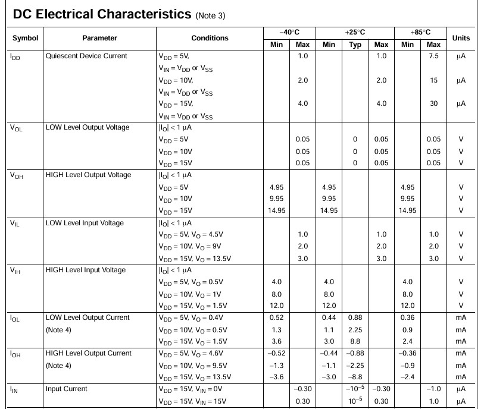

Además, el circuito equivalente dado en los datasheets del dispositivo es:

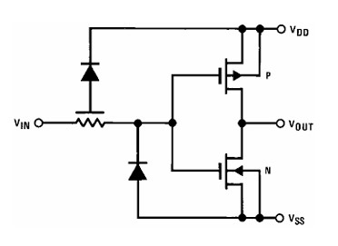

Como podemos observar, existen diferencias notables entre estos dos dispositivos. La más evidente es la complejidad de sus circuitos equivalentes. La tecnología TTL utiliza una variedad de transistores BJT (transistor bipolar de unión), y en la variante TTL Schottky, se incorporan diodos Schottky para mejorar la velocidad de conmutación. Por otro lado, la tecnología CMOS es mucho más sencilla, utilizando únicamente dos transistores, uno NMOS y otro PMOS.

Estas diferencias en la topología de los circuitos tienen repercusiones que se evidencian en las tablas mostradas. Por ejemplo, los tiempos de conmutación (tPLH y tPHL) son generalmente más rápidos en la tecnología TTL debido a los transistores Schottky. Además, los niveles de voltaje manejados en la tecnología TTL son más altos, ya que es necesario alimentar una mayor variedad de componentes. En cambio, la tecnología CMOS, al ser más sencilla, consume mucho menos energía.

# Cálculos y simulaciones
## Negador TTL 74LS04

Para el TTL vamos a utilizar una alimentación de 5V.

### Características DC

Vamos a analizar los valores $V_{IH}, V_{IL}, V_{OH}, V_{OL}$; para ello variamos la señal de entrada de 0V a 5V $(V_{in})$ y la comparamos con una señal de salida $(V_{out})$ que será el voltaje sobre una carga de $10k\Omega$ en la salida del negador. Cuando el voltaje de salida pase de bajo a alto nos indicará el $V_{IL}$ y cuando pase de alto a bajo nos indicará el $V_{IH}$ y el voltaje de salida corresponde a $V_{OH}$ y $V_{OL}$.
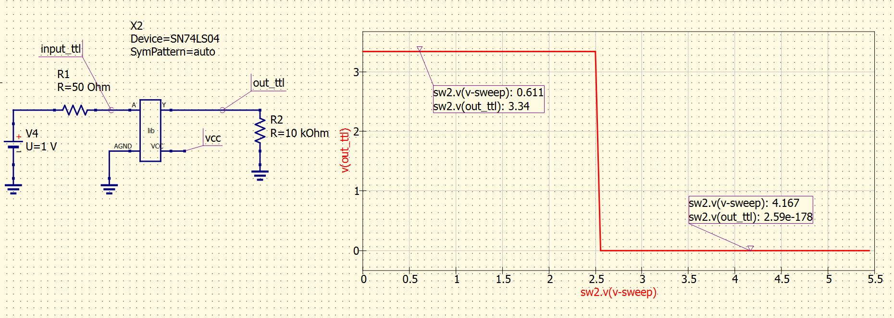

$$
\begin{align}
V_{IH}=2.5V\\
V_{IL}=2.5V\\
V_{OH}=3.34V\\
V_{OL}=0V
\end{align}
$$

### Características AC

Vamos a analizar los tiempos de retardo $(t_{PLH}, t_{PHL})$ y tiempos de almacenamiento $(t_{THL}, t_{TLH})$, para ello la entrada será una señal cuadrada de 1kHz con un tiempo de subida y de bajado de 20 ns, y la salida nuevamente será una carga de $10k\Omega$.
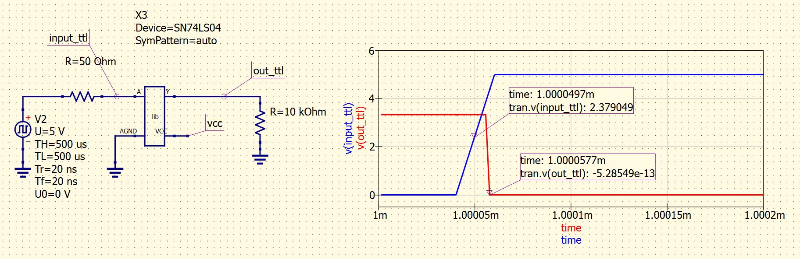
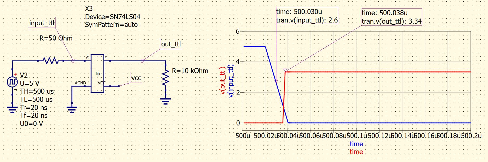
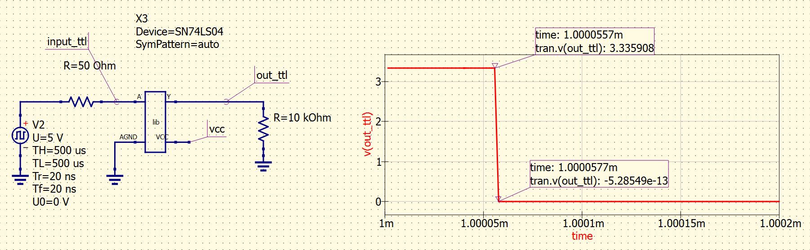
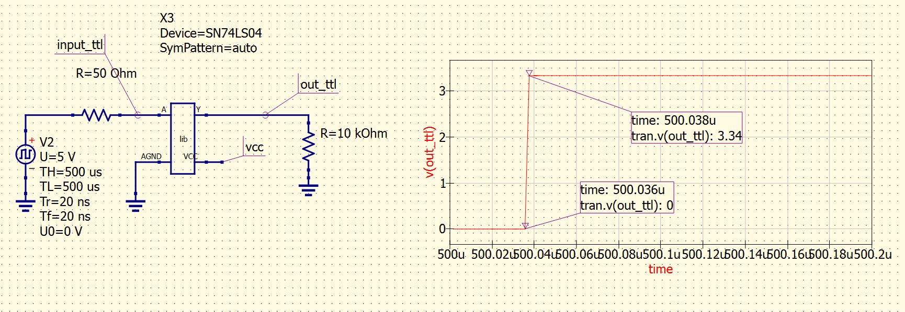

$$
\begin{align}
t_{PHL}=8ns\\
t_{PLH}=8ns\\
t_{THL}=2ns\\
t_{TLH}=2ns
\end{align}
$$

### Fan - Out

Para el Fan - Out vamos a tomar como referencia el $V_{OH}$ del datsheet el cual es de 2.7V; la entrada será de 0V y la carga a la salida será una resistencia variable. Cuando la tensión a la salida sea de $V_{OH}$ el Fan - Out corresponde a la corriente de salida.
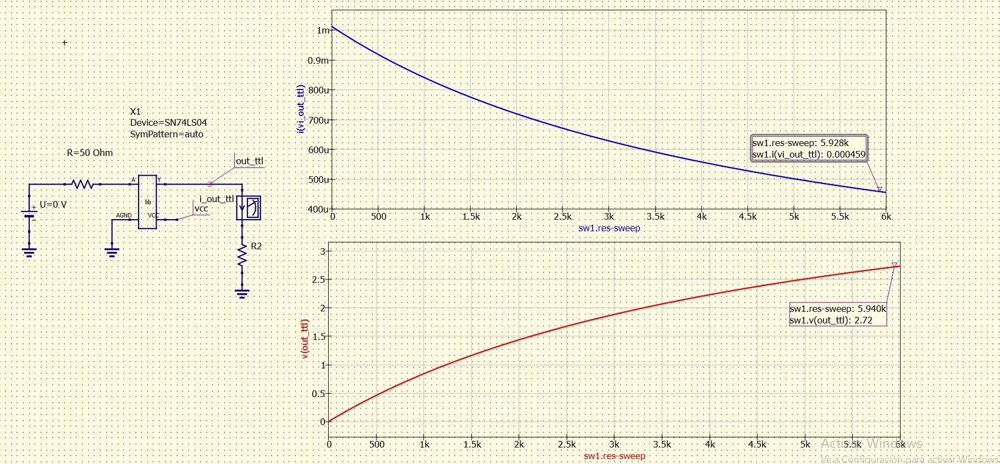

Obtenemos un Fan - Out de $459\mu A$

## Negador CMOS CD4069

Para el CMOS vamos a utilizar una alimentación de 5V.

### Características DC

Vamos a analizar los valores $V_{IH}, V_{IL}, V_{OH}, V_{OL}$; para ello variamos la señal de entrada de 0V a 5V $(V_{in})$ y la comparamos con una señal de salida $(V_{out})$ que será el voltaje sobre una carga de $10k\Omega$ en la salida del negador. Cuando el voltaje de salida pase de bajo a alto nos indicará el $V_{IL}$ y cuando pase de alto a bajo nos indicará el $V_{IH}$ y el voltaje de salida corresponde a $V_{OH}$ y $V_{OL}$.
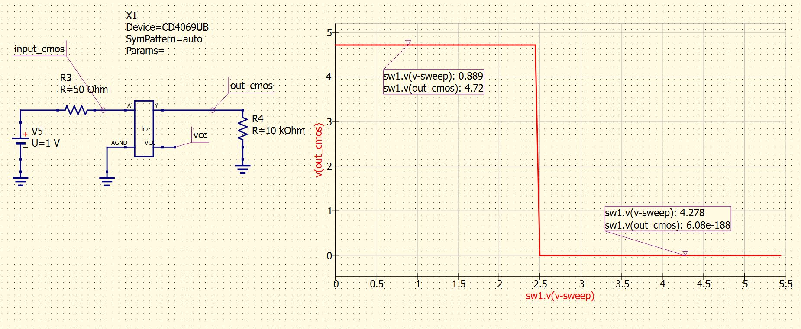

$$
\begin{align}
V_{IH}=2.5V\\
V_{IL}=2.5V\\
V_{OH}=4.72V\\
V_{OL}=0V
\end{align}
$$

### Características AC

Vamos a analizar los tiempos de retardo $(t_{PLH}, t_{PHL})$ y tiempos de almacenamiento $(t_{THL}, t_{TLH})$, para ello la entrada será una señal cuadrada de 1kHz con un tiempo de subida y de bajado de 20 ns, y la salida nuevamente será una carga de $10k\Omega$.
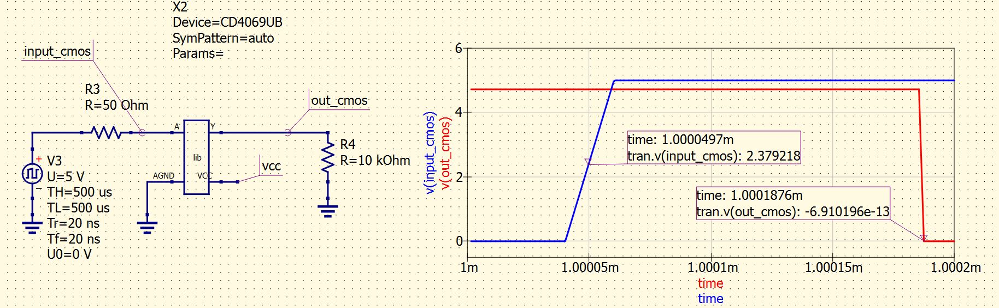
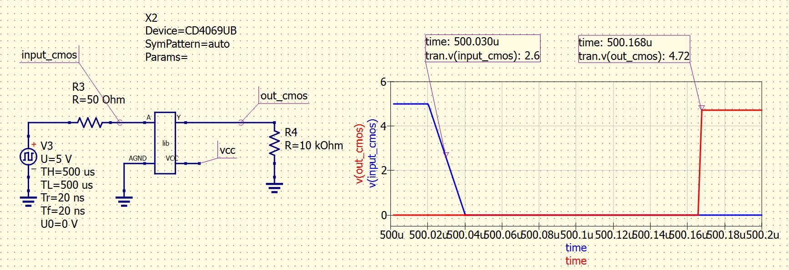
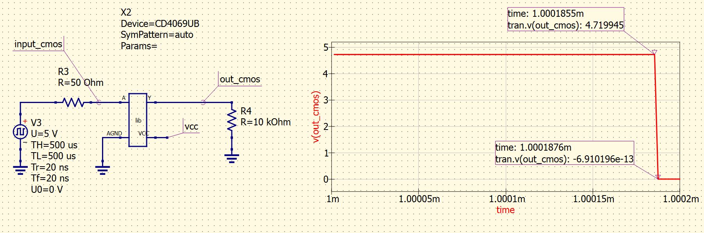
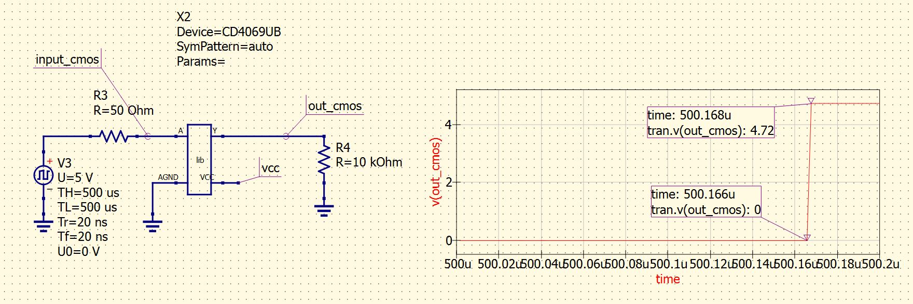

$$
\begin{align}
t_{PHL}=138ns\\
t_{PLH}=138ns\\
t_{THL}=2ns\\
t_{TLH}=2ns
\end{align}
$$

### Fan - Out

Para el Fan - Out vamos a tomar como referencia el $V_{OH}$ del datsheet el cual es de 4.95V; la entrada será de 0V y la carga a la salida será una resistencia variable. Cuando la tensión a la salida sea de $V_{OH}$ el Fan - Out corresponde a la corriente de salida.
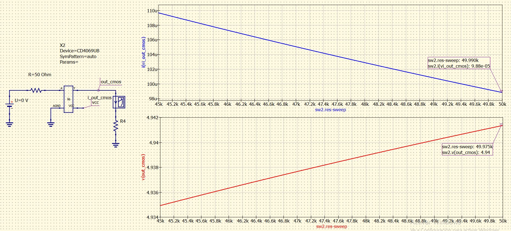

Obtenemos un Fan - Out de $98.8\mu A$

## Oscilador en anillo

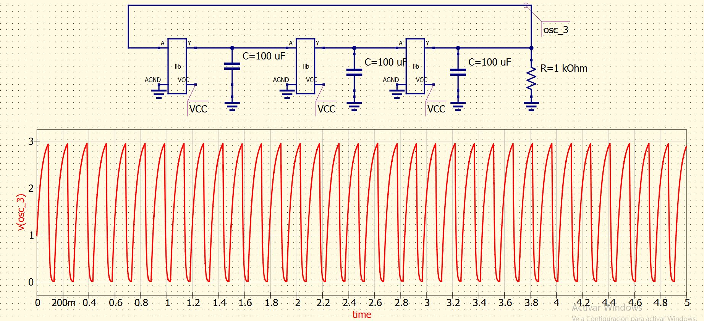

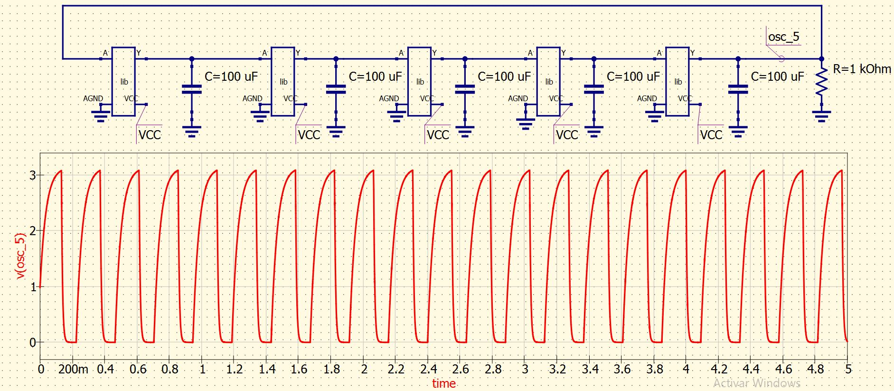

# Resultados Experimentales 
## Negador CMOS CD4069

### Tiempo de Almacenamiento
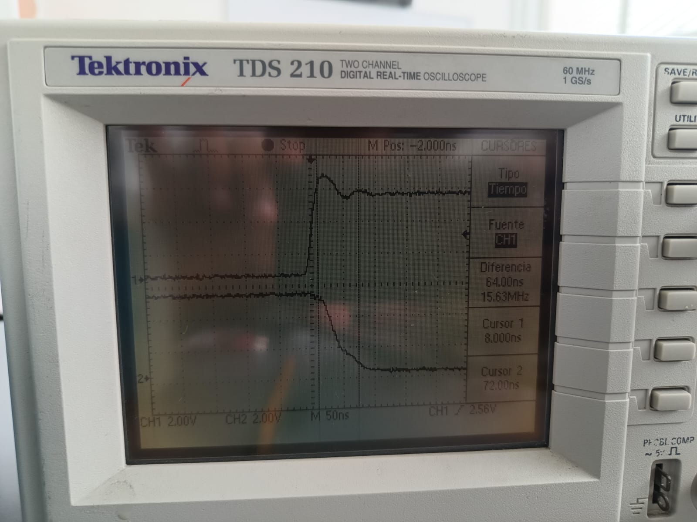

$TPLH = 64.00ns$

### Tiempo de Delay
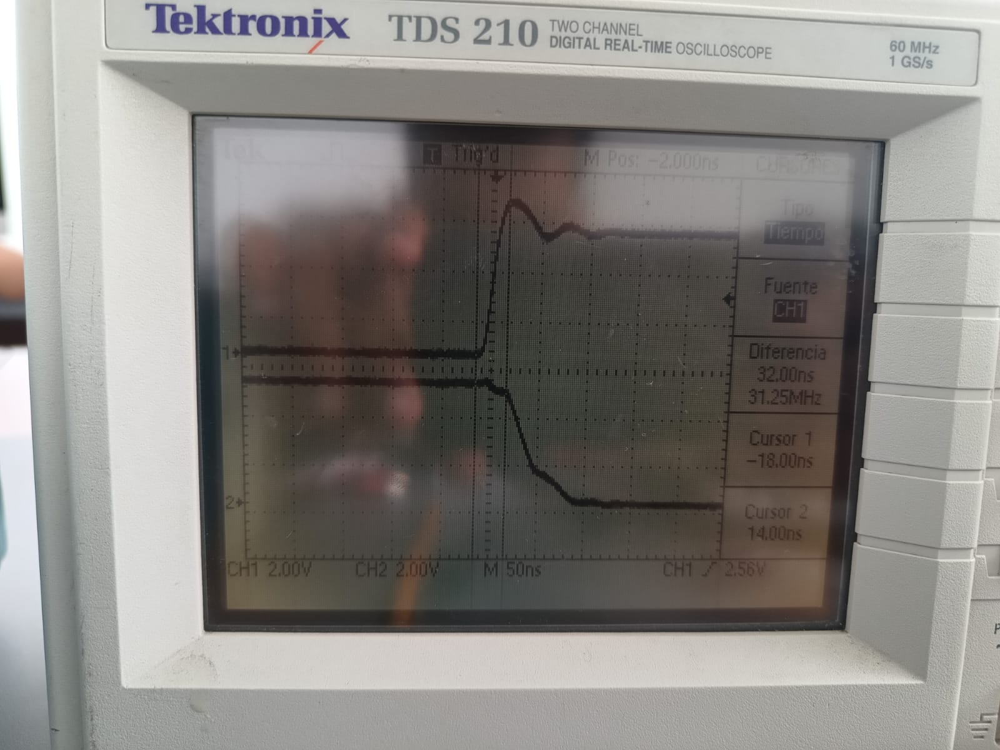

$TPHL = 32.00ns$

### Fan-in 

### Fan-out

### Potencia disipada

### Características de voltaje

 | Parámetro | Valor nominal (Datasheet) | Valor Simulado           | Valor experimental  | Error porcentual (%) |
|-------------|-------------             |       -----------        |       -----------   |-------------         |
| $V_{IL} $   |      1.0                 |            2.5           | 1.409               |    40.9              |
| $V_{IH}$    |       4.0                |            2.5           |   4.059             |   1.475              |
| $V_{OL}$    |       0.05               |            0             |  0.004              |        92            | 
| $V_{OH}$    |      4.95                |        4.72              |  4.801              |     3.01             | 

Las fotos de las mediciones para CMOS y TTL se encuentran en: [Anexos de Mediciones](https://docs.google.com/document/d/1huVV0JdHspE3xCMzzdIQ4rvsg7iDnN15pNWeRtljhYE/edit?tab=t.0)

### $T_{PLH}$ y $T_{PHl}$  encontrados 

 | Parámetro (ns)  | Valor nominal (Datasheet) | Valor Simulado | Valor experimental | Error porcentual (%) |
|-------------|-------------                  |   ------------- |      -----------   |-------------         |
| $T_{PLH} $   | 50.0 - 90.0                  |      138.0      |    64.0            |      73.33      |
| $T_{PHl} $    | 50.0 - 90.0                 |       138.0     |   32.0            |   46.66          |

## Negador TTL 74LS04

### Tiempo de Almacenamiento
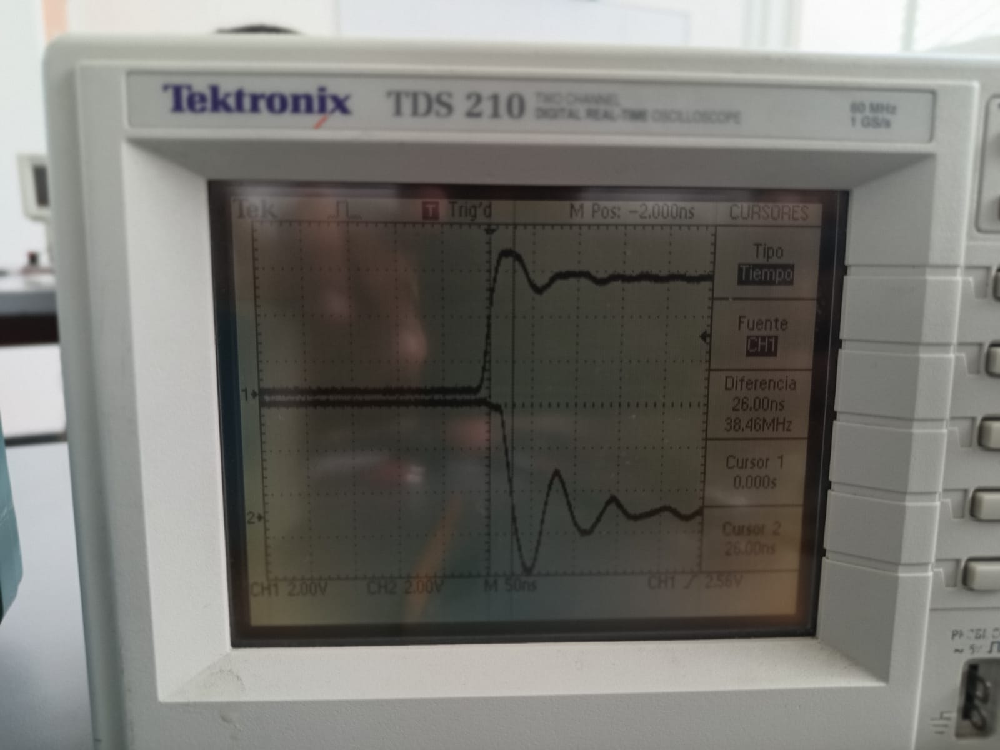

$TPLH = 26.00ns$

### Tiempo de Delay
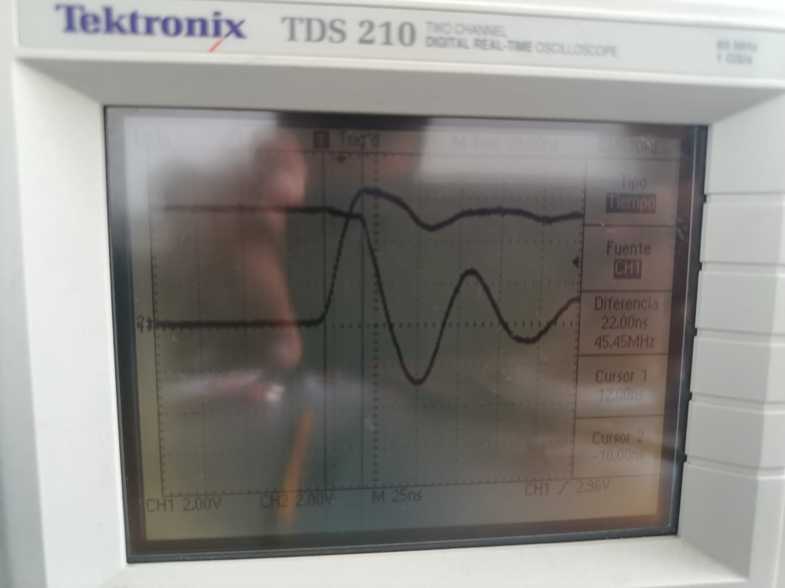
$TPHL = 22.00ns$

### $V_{in}$ vs $V_{out}$

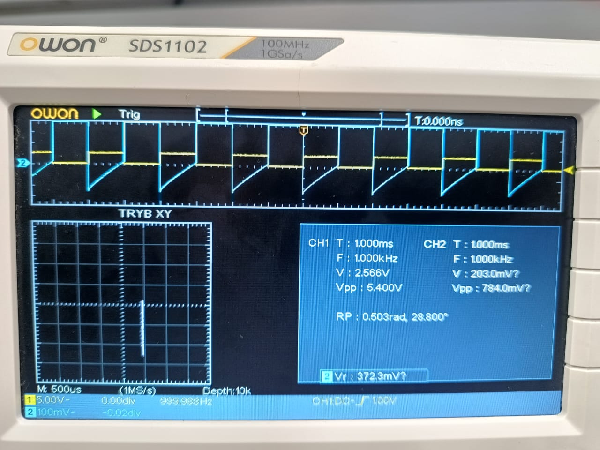

### Fan-in 

### Fan-out

### Potencia disipada

### Características de voltaje

 | Parámetro  | Valor nominal (Datasheet) | Valor Simulado | Valor experimental | Error porcentual (%) |
|-------------|-------------              |   ------------- |      -----------  |-------------         |
| $V_{IL} $   | 0.8                       |       2.5         |  2.199             |      174.875      |
| $V_{IH}$    | 2.0                       |         2.5       |   2.899            |   44.95           |
| $V_{OL}$    |      0.25                 |         0       | 0.039              |      84.4         |
| $V_{OH}$    |       3.5                 |       3.34         |    4.946           |    41.314         |  

### $T_{PLH}$ y $T_{PHl}$  encontrados 

 | Parámetro (ns)  | Valor nominal (Datasheet) | Valor Simulado | Valor experimental | Error porcentual (%) |
|-------------|-------------                  |   ------------- |      -----------   |-------------         |
| $T_{PLH} $   | 9.0 - 15.0                    |      8.0       |  26.0             |      73.33      |
| $T_{PHl} $    | 10.0 - 15.0                  |      8.0       |   22.0            |   46.66          |

Las fotos de las mediciones para CMOS y TTL se encuentran en: [Anexos de Mediciones](https://docs.google.com/document/d/1huVV0JdHspE3xCMzzdIQ4rvsg7iDnN15pNWeRtljhYE/edit?tab=t.0)

## Oscilador en Anillo CMOS

### Oscilador de 2 compuertas lógicas

Circuito utilizado:

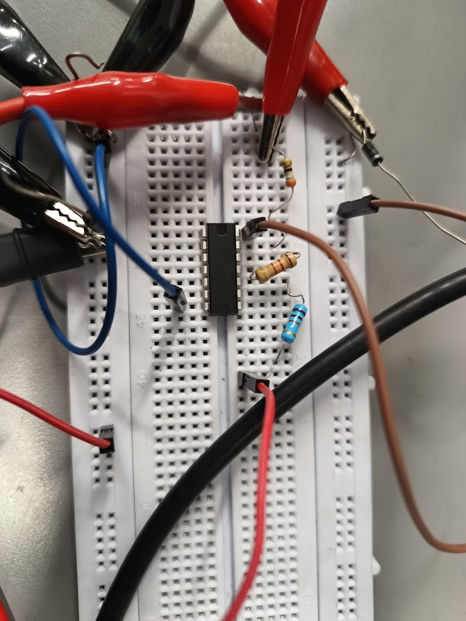

Salida Negador 1 vs Entrada Inicial: En primer lugar, es posible observar en la siguiente imagén la comparación de la entrada inicial vs la salida del primer negador.

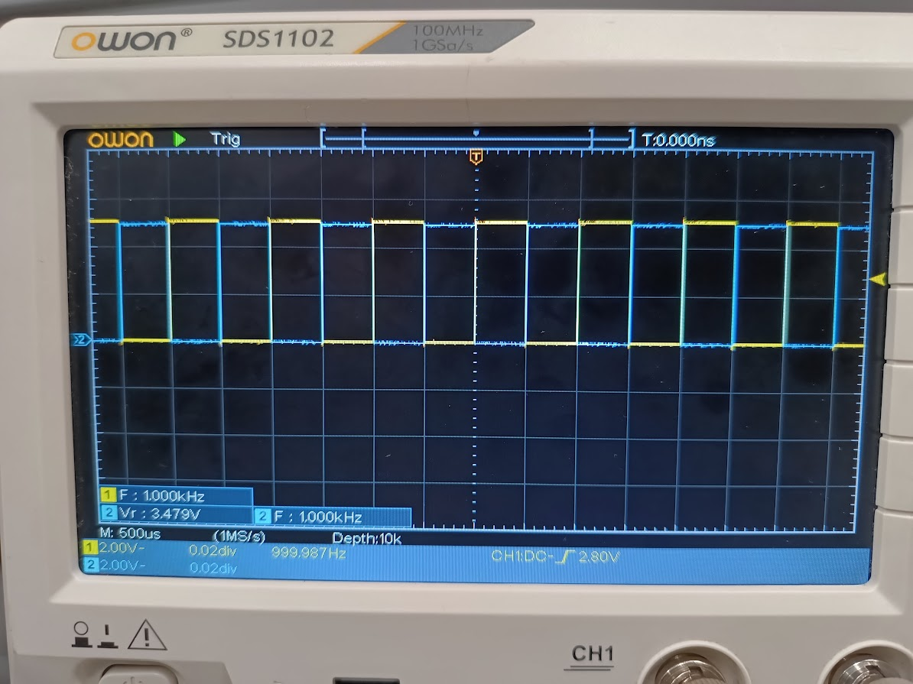

Salida Negador 2 vs Entrada Inicial: En la siguiente imagén vemos la entrada inicial comparada con la salida del segundo negador. Al compararlas se observa una pequeña bajada en el nivel de tensión, lo cual, ocurre porque los inversores tienen una resistencia interna que afecta los niveles de salida, además de que las capacitancias parasitarias ralentizan las transiciones. También puede ocurrir porque durante los cambios de estado de la señal cuadrada, hay un breve momento en que ambos transistores internos conducen, lo que genera pequeñas pérdidas. 

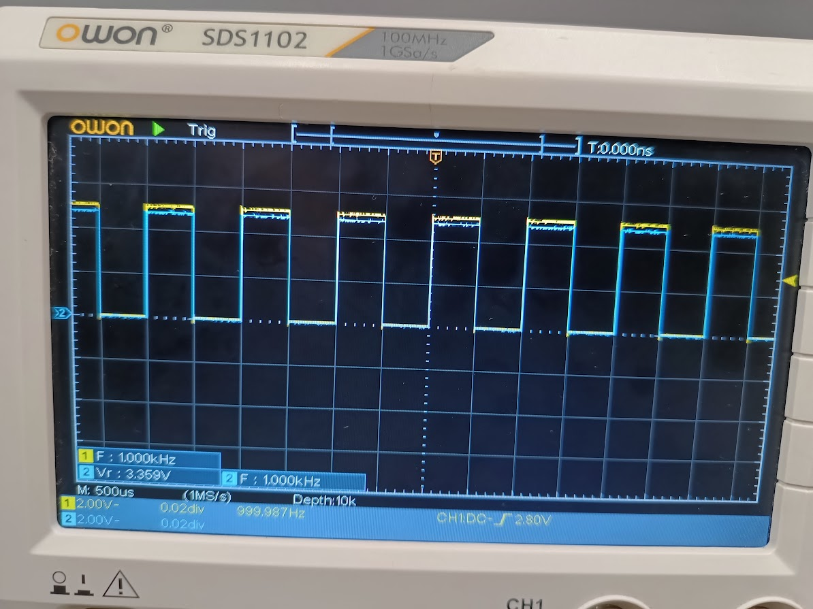

### Oscilador de 3 compuertas lógicas 

Circuito utilizado:

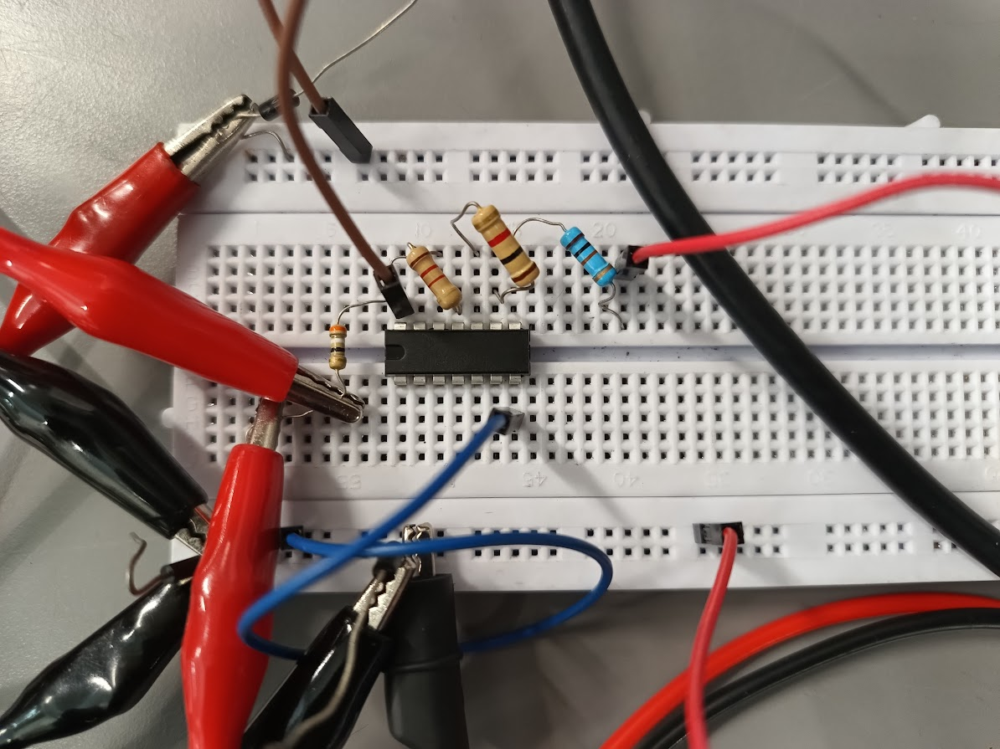

Salida Negador 1 vs Entrada Inicial:

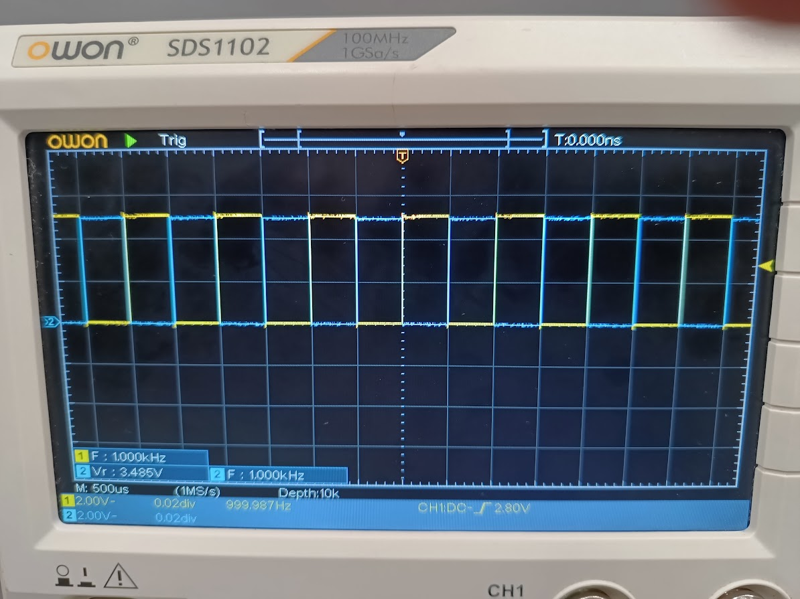

Salida Negador 2 vs Entrada Inicial:

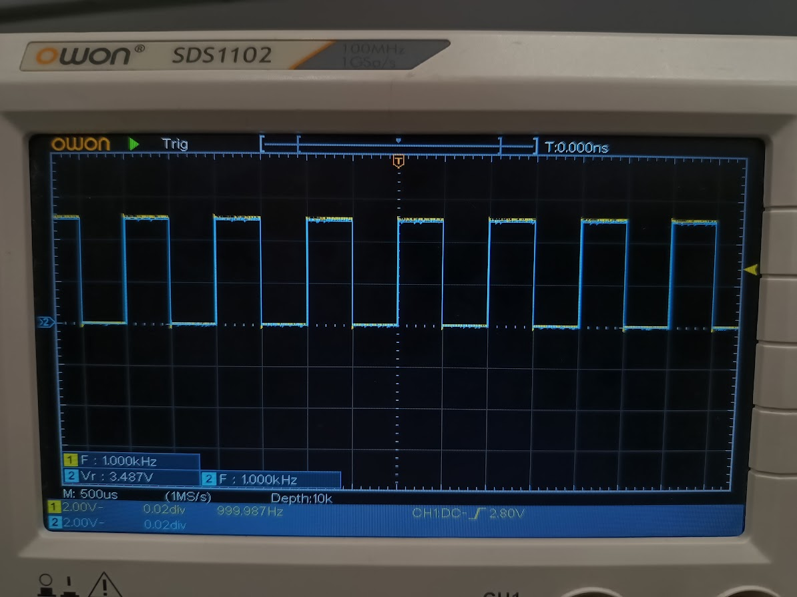

Salida Final:

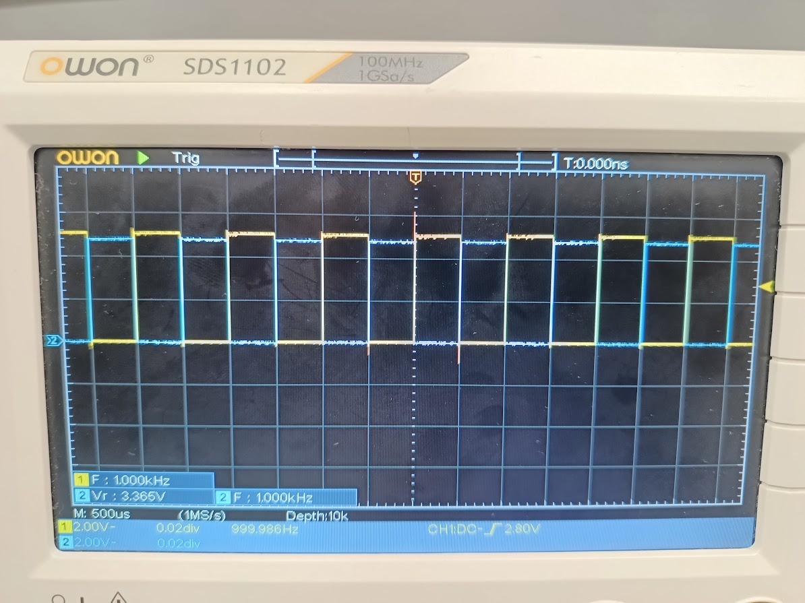

En este caso, con el oscilador en anillo con tres negadores, vemos que, en la salida final, la del tercer negador, hay una pequeña caída de voltaje (alrededor de $0.2V$). Constrastando con las simulaciones realizadas se evidencia 
