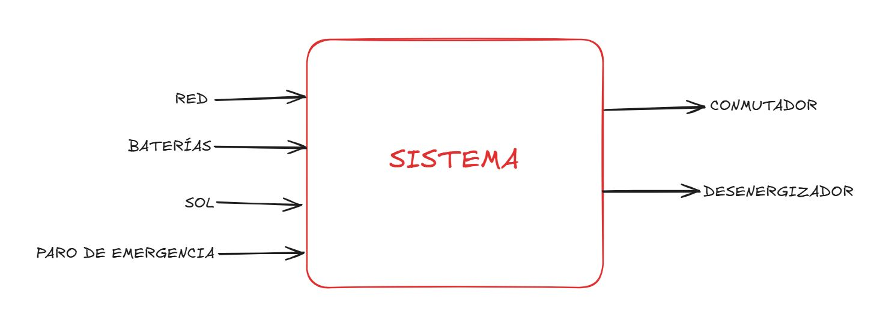
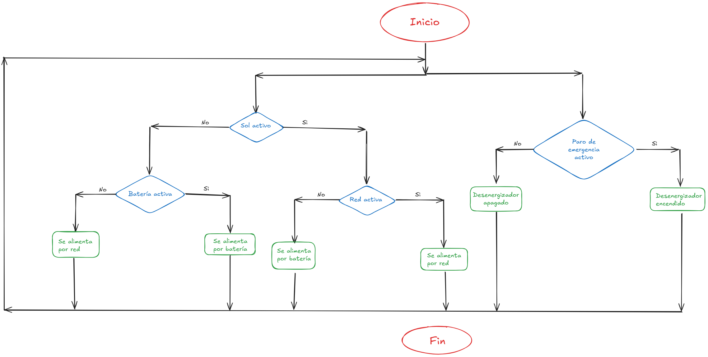
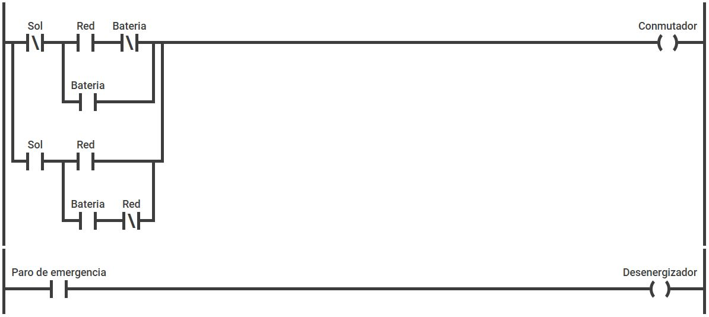
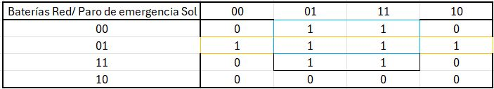
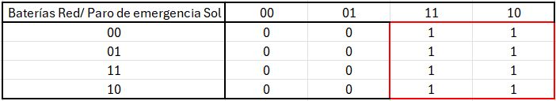
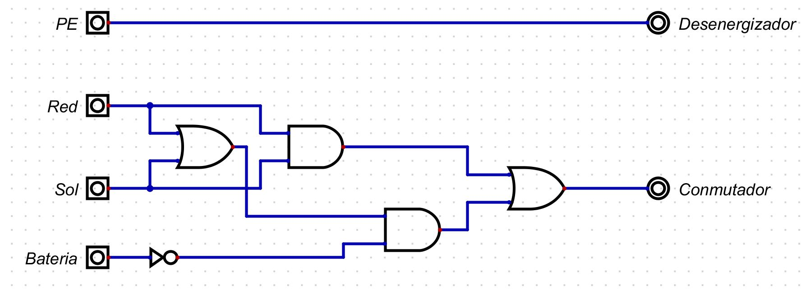
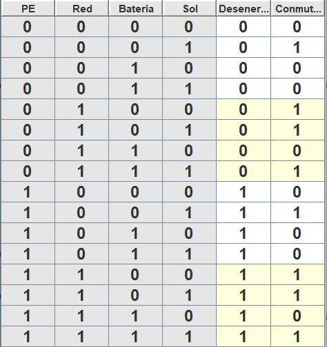
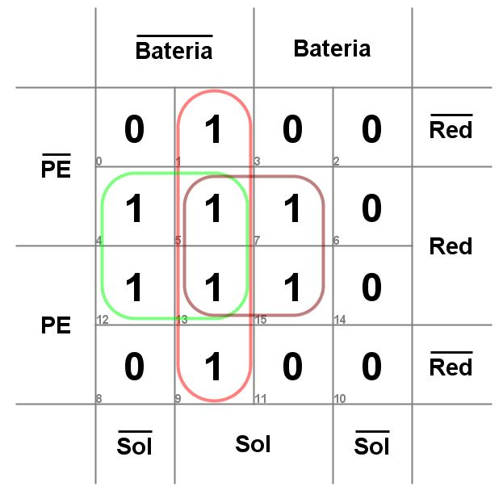
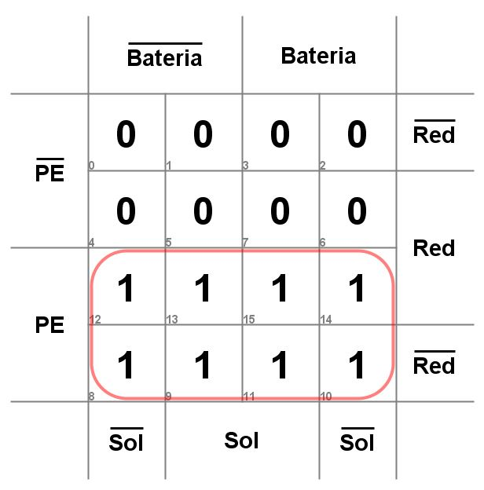
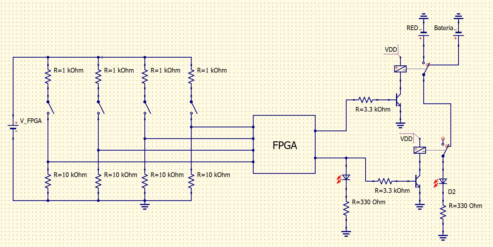

# DISEÑO DE ALIMENTACIÓN DE UNA CASA
| Electrónica Digital I | Grupo 4 | Equipo 3 |
|------------------------|---------|----------|

- Nicolás Garzón Peña
- José Alejandro López Vargas
- Johan Stiven Tovar López
___

## Dominio comportamental

Empezaremos por definir las entradas y salidas del sistema. Para este problema vamos a tener en cuenta 4 entradas, que corresponden a:
- Las dos fuentes de alimentación posibles (Red o baterías).
- La presencia de luz solar.
- El paro de emergencia.

En cuanto a las salidas tendremos dos, un relé conmutador que definirá si la casa se alimenta por medio de la red o las baterías; y un relé energizador que permitirá a la casa conectarse a la red.

Antes de continuar vamos a hacer algunas aclaraciones sobre el funcionamiento del sistema
- Si el desenergizador esta activo entonces la casa no tiene alimentación.
- Si el conmutador está activo la casa se conecta a la red, si no está activo se conecta a las baterías.
- La principal función del sol es dar prioridad en caso de que tanto la red como las baterías estén disponibles. Siguiendo la lógica de que las baterías se recargan con la luz del sol, cuando haya sol la prioridad será la red, cuando no haya sol la prioridad serán las baterías.
- En caso de que solo una de las fuentes (red o batería) esté disponible, la casa se conectará a la fuente que este disponible sin importar el estado del sol.

Con esto en mente podemos plantear la tabla de verdad

| **Paro de emergencia** | **Sol** | **Baterías** | **Red** | **Conmutador** | **Desenergizador** |
|:----------------------:|:-------:|:------------:|:-------:|:--------------:|:------------------:|
|            0           |    0    |       0      |    0    |        0       |          0         |
|            0           |    0    |       0      |    1    |        1       |          0         |
|            0           |    0    |       1      |    0    |        0       |          0         |
|            0           |    0    |       1      |    1    |        0       |          0         |
|            0           |    1    |       0      |    0    |        1       |          0         |
|            0           |    1    |       0      |    1    |        1       |          0         |
|            0           |    1    |       1      |    0    |        0       |          0         |
|            0           |    1    |       1      |    1    |        1       |          0         |
|            1           |    0    |       0      |    0    |        0       |          1         |
|            1           |    0    |       0      |    1    |        1       |          1         |
|            1           |    0    |       1      |    0    |        0       |          1         |
|            1           |    0    |       1      |    1    |        0       |          1         |
|            1           |    1    |       0      |    0    |        1       |          1         |
|            1           |    1    |       0      |    1    |        1       |          1         |
|            1           |    1    |       1      |    0    |        0       |          1         |
|            1           |    1    |       1      |    1    |        1       |          1         |

El diagrama de flujo es el siguiente

## Dominio físico

La simulación del lenguaje ladder se encuentra en el siguiente link: [Simulación circuito eléctrico](https://app.plcsimulator.online/AEIUClyaTTtEORz1RNlr)

## Dominio estructural

Mediante la tabla de verdad realizamos el diagrama de karnaugh del conmutador y del desenergizador

Por tanto las ecuaciones booleanas quedan de la siguiente manera

$$
\begin{align}
DE=PE\\
C=\bar{B}\cdot S+\bar{B}\cdot R+R\cdot S\\
C=\bar{B}\cdot (S+R)+R\cdot S
\end{align}
$$

Donde:
- PE: Paro de emergencia.
- DE: Desenergizador.
- C: Conmutador.
- B: Baterías.
- R: Red.
- S: Sol.

Con esto ya podemos diseñar nuestro circuito digital
Con esto ya podemos diseñar nuestro circuito digital

Finalmente el circuito a implementar es el siguiente

## Resultados Experimentales

[Diseño de Sistema de Energía Solar Finca - Funcionalidad](https://drive.google.com/file/d/1AAEFybpyCXSrWc_owh3aqdBvK1kTkQ-j/view?usp=drivesdk)

## Análisis

Se puede evidenciar en el video que el sistema desde el instante inicial se encuentra activo algo que en general no debería ocurrir ya que para el momento t=0000s se debería tener todo apagado pero pues en este caso no ocurre por la esctructura del circuito diseñado. Básicamente el circuito cumple con los estándares pedidos para el diseño y se obtiene la disposición requerida para abastecer la finca familiar, y para que sea eficiente energéticamente.

## Conclusiones

- El proyecto de sistema de energía solar fue muy interesante y nos sirvió para entender cómo transformar una necesidad práctica en una solución tecnológica. Aprendimos que un mismo problema se puede abordar desde múltiples perspectivas, desde lo comportamental hasta la implementación en FPGA.

- Descubrimos la importancia de un enfoque sistemático en diseño electrónico. Cada etapa del proyecto añadió capas de conocimiento y refinamiento, mostrándome las diferentes tecnologías para resolver problemas de ingeniería.

- Las herramientas utilizadas, desde simuladores ladder hasta entornos de síntesis en FPGA, expandieron nuestra visión del diseño electrónico. Cada una aportó una perspectiva única para validar y refinar soluciones.

- Las lecciones principales fueron la importancia de la metodología sistemática y un enfoque integral. Aprendimos que el diseño moderno requiere pensamiento sistémico y capacidad de abstraer problemas más allá de lo tradicional.
