# Semáforo inteligente

## Introducción

## Diseño

Para este proyecto vamos diseñar un circuito que maneje los semáforos de una intersección de 2 calles en doble sentido en función del tráfico de cada una; teniendo un total de 4 semáforos, que llamaremos semáforo A, B, C, D.

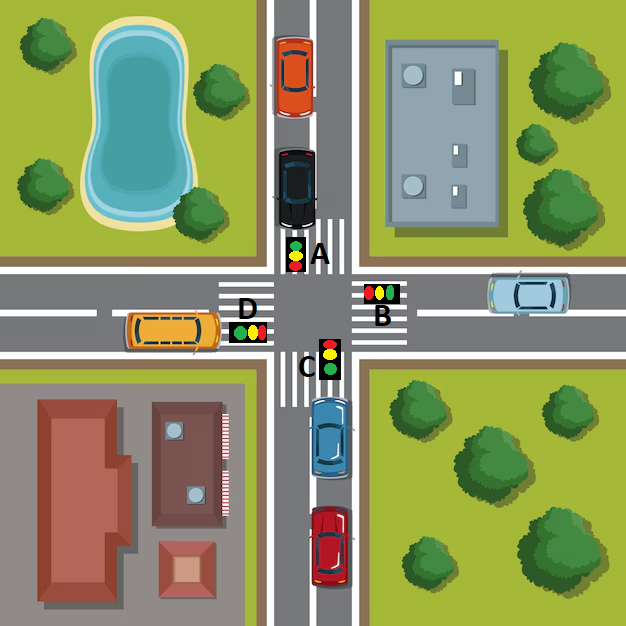

### Entradas y salidas

Las entradas constarán de un par de sensores que medirán tanto el tráfico que entra como el tráfico que sale, que llamaremos Xp y Xl respectivamente, para un total de 8 entradas. Las salidas serán la iluminación del semáforo (Rojo, amarillo o verde), que llamaremos RX, AX y VX, para un total de 12 salidas.

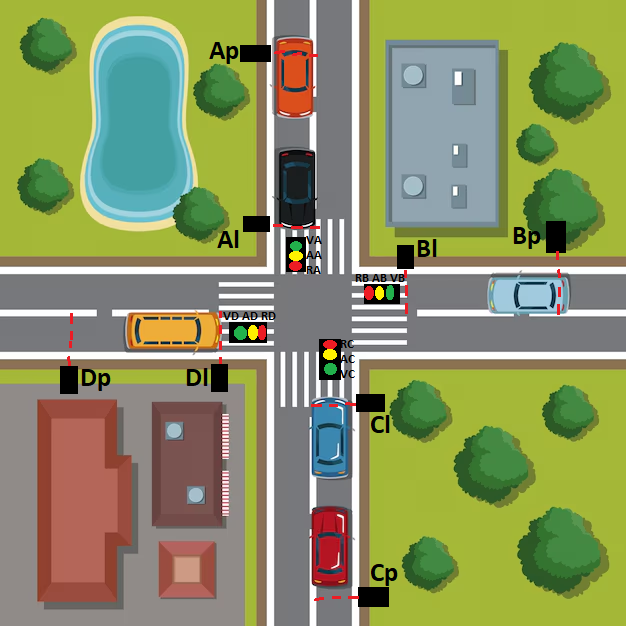

### Diagrama de bloques

El proyecto lo definimos en distintas etapas. Primeramente, las señales de entrada deberán pasar por un contador que sume los carros que entran a la calle y reste los carros que salgan de la misma. Después, necesitamos saber cúal es la calle con más tráfico, por lo que la señal de los contadores pasará por un comparador que determine cúal es la calle con más tráfico. Una vez definido el estado actual del tráfico, una máquina de estados decide cúal es el estado siguiente siguiente que los semáforos deben tomar. Finalmente, según las salidas de la máquina de estados, cada semáforo tiene su propia lógica que establece que luz se debe prender.

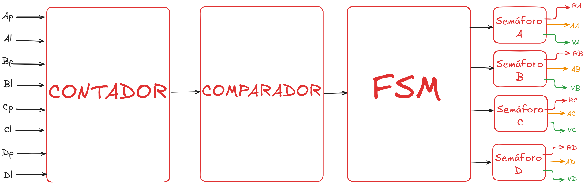

### Contador

Vamos a trabajar con un contador de 6 bits, de esta manera se puede contar tráfico del 0 al 63.
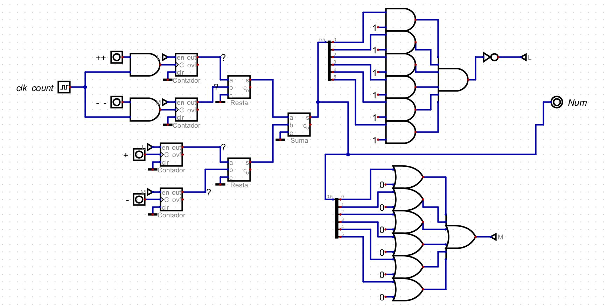

La entrada y salida del tráfico la simulamos con 2 pulsadores, "+" y "-" respectivamente; así mismo las entradas "++" y "--" cumplen la misma función pero se conectan con una señal reloj adicional para subir o bajar más rápido el contador, aunque no tienen niguna aplicación real. Los valores de los contadores se restan para sacar el tráfico total y con ello obtenemos la salida "Num" que es el número de 6 bits. Adicional a esto tenemos 2 circuitos combinacionales que tienen como salida "L" y "M", los cuales activan o desactivan la función enable de los contadores. La "L" impide que el número pase de 63 a 0 y la "M" impide que el número pase de 0 a 63.

### Comparador 


El comparador tiene 4 entradas de 6 bits, que corresponde al tráfico de cada semáforo y son NA, NB, NC, ND; y 4 salidas de 1 bit TA, TB, TC y TD que representarán cuál es el semáforo con mayor tráfico. Para definir el número mayor se emparejan los números en NA - NB, y NC - ND y se comparan, los dos números mayores pasan a un nuevo comparador y con esto ya sabemos cúal es el número mayor. Además de esto, hay una serie de compuertas lógicas y multiplexores que defininen las salidas. Una aclaración con este circuito es ¿qué pasaría si dos o más semáforos tienen el mismo tráfico?, en este caso se escogió de manera arbitraria la siguiente jerarquía:

1. Tráfico A
2. Tráfico B
3. Tráfico C
4. Tráfico D

Lo que quiere decir que el semáforo A tiene mayor prioridad y el semáforo D el de menor prioridad.

### Máquina de estados 
La máquina de estados tendrá 4 de entradas de 1 bit que son TA, TB, TC y TD que representan el estado presente, a partir de esto definimos los distintos estados que puede tomar la máquina.

#### Estados

De manera intuitiva se podría pensar que los estados de la máquina son todas las posibles combinaciones que pueden haber entre las luces de los semáforos, sin embargo esto no es cierto, ya que hay una restricción de que solo puede haber un semáforo en verde a la vez; así que en base a esto definimos nuestros 4 primero estados:

1. Semáforo A en verde y B, C, D en rojo (E0)
2. Semáforo B en verde y A, C, D en rojo (E2)
3. Semáforo C en verde y A, B. D en rojo (E4)
4. Semáforo D en verde y A, B, C en rojo (E6)

 Con esto nos percatamos que los estados restantes corresponden a la transición entre cada uno de los 4 estados, siendo los siguientes:

5. Semáforo A y B en amarillo y C y D en rojo (E1)
6. Semáforo A y C en amarillo y B y D en rojo (E9)
7. Semáforo A y D en amarillo y B y C en rojo (E8)
8. Semáforo B y C en amarillo y A y D en rojo (E3)
9. Semáforo B y D en amarillo y A y C en rojo (E7)
10. Semáforo C y D en amarillo y A y B en rojo (E5)

Obteniendo un total de 10 estados

#### Transición de estados

Empezamos por el diagrama de transición de estados

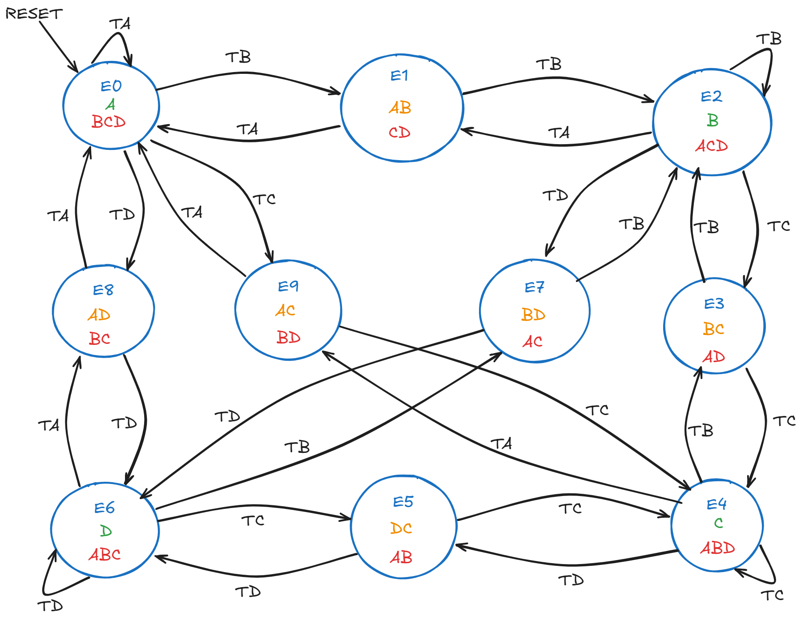

Para codificar los estados vamos a usar binario obteniendo la siguiente tabla

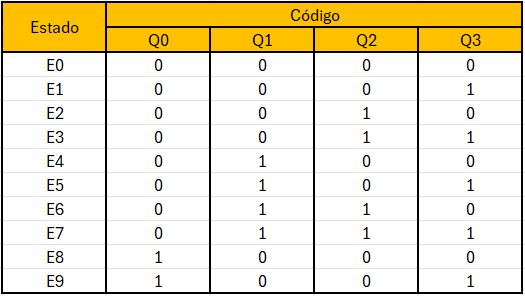

Con base a la codificación nos damos cuenta de que necesitamos 4 Flip-Flops para nuestra máquina de estados

Con esto ya podemos armar nuestra tabla de transición de estados

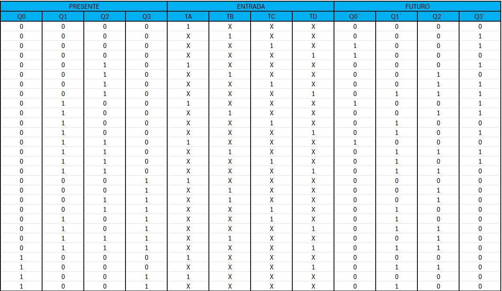

Las ecuaciones de $Q0'\; Q1'\;  Q2'\; Q3'$ las obtenemos a partir de la suma de productos (SoP), también tenemos en cuenta la tabla de transición y la tabla de excitación de los diferentes Flip-Flop; y se determinó que los Flip-Flop que generan ecuaciones con menos términos, son Flip-Flop tipo D para $Q0' \; Q3'$ y Flip-Flop tipo JK para $Q1' \; Q2'$. De manera que obtenemos la siguiente tabla.

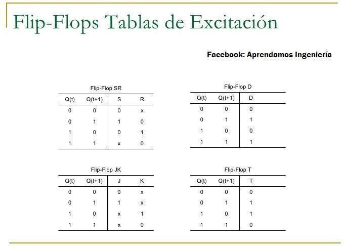
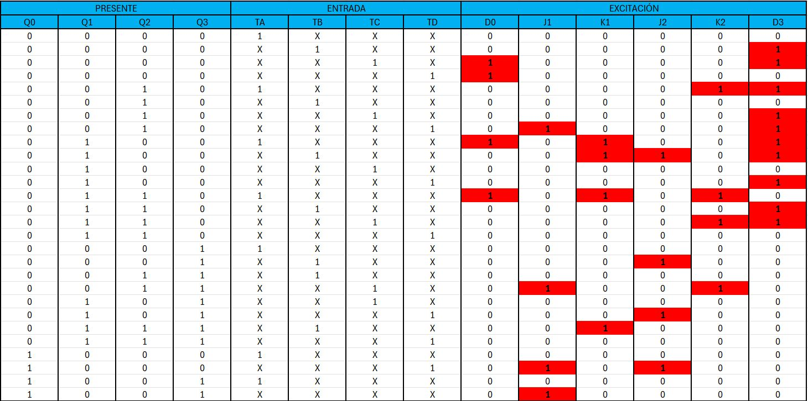

La ecuaciones que obtenemos son las siguientes

$$
\begin{align}
D0=(TC+TD)\cdot \bar{Q0}\bar{Q1}\bar{Q2}\bar{Q3}+TA\cdot(\bar{Q0} Q1 \bar{Q2}\bar{Q3} + \bar{Q0} Q1Q2 \bar{Q3})\\
J1=TD\cdot (\bar{Q0}\bar{Q1} Q2 \bar{Q3} + Q0 \bar{Q1}\bar{Q2}\bar{Q3})+TC\cdot (\bar{Q0}\bar{Q1} Q2 Q3 + Q0 \bar{Q1}\bar{Q2} Q3\\
K1=(TA+TB) \cdot (\bar{Q0} Q1 \bar{Q2}\bar{Q3})+TA\cdot (\bar{Q0} Q1 Q2 \bar{Q3})+TB\cdot (\bar{Q0} Q1Q2Q3)\\
J2=TB\cdot (\bar{Q0} Q1 \bar{Q2}\bar{Q3} + \bar{Q0}\bar{Q1}\bar{Q2} Q3) + TD\cdot (\bar{Q0} Q1 \bar{Q2} Q3 + Q0 \bar{Q1}\bar{Q2}\bar{Q3})\\
K2=(TA+TC)\cdot (\bar{Q0} Q1Q2 \bar{Q3}) +TA\cdot (\bar{Q0}\bar{Q1} Q2 \bar{Q3})+ TC\cdot (\bar{Q0}\bar{Q1} Q2Q3)\\
D3=(TB+TC)\cdot (\bar{Q0}\bar{Q1}\bar{Q2}\bar{Q3})+(TA+TC+TD)\cdot (\bar{Q0}\bar{Q1}Q2 \bar{Q3})+(TA+TB+TD)\cdot (\bar{Q0} Q1 \bar{Q2}\bar{Q3})+(TB+TC)\cdot (\bar{Q0} Q1Q2 \bar{Q3})
\end{align}
$$

Obteniendo el siguiente circuito

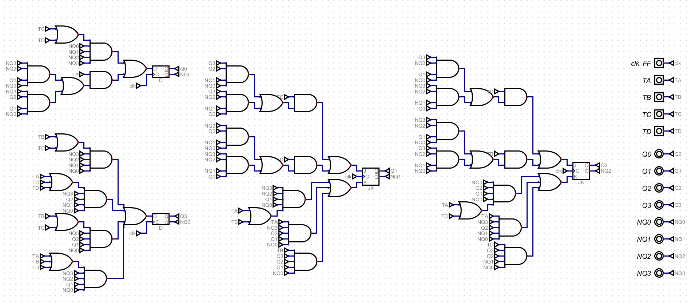

### Salidas

Planteamos la tabla de salidas

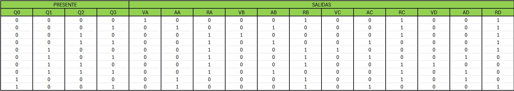

Planteamos la tabla de Karnaugh de cada salida para hallar su circuito

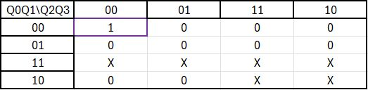

$$VA=\bar{Q0}\bar{Q1}\bar{Q2}\bar{Q3}$$


$$AA=Q0+\bar{Q1}\bar{Q2}Q3$$

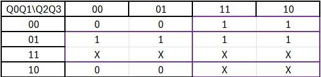

$$RA=Q1+Q2$$

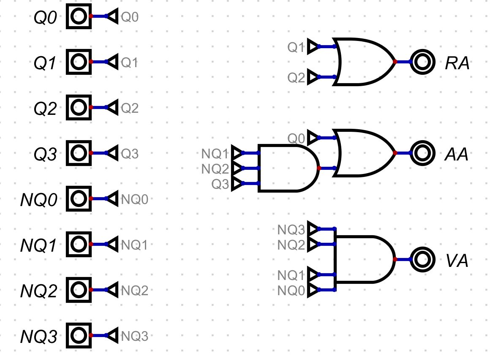

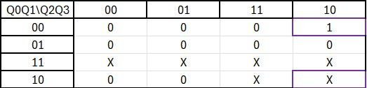

$$VB=\bar{Q1} Q2 \bar{Q3}$$

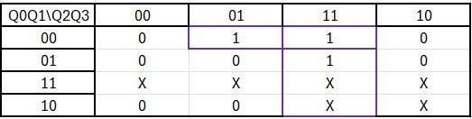

$$AB=Q2Q3+\bar{Q0}\bar{Q1} Q3$$

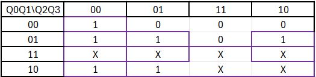

$$RB=Q0+\bar{Q2}\bar{Q3}+Q1Q2\bar{Q3}+Q1\bar{Q2}$$

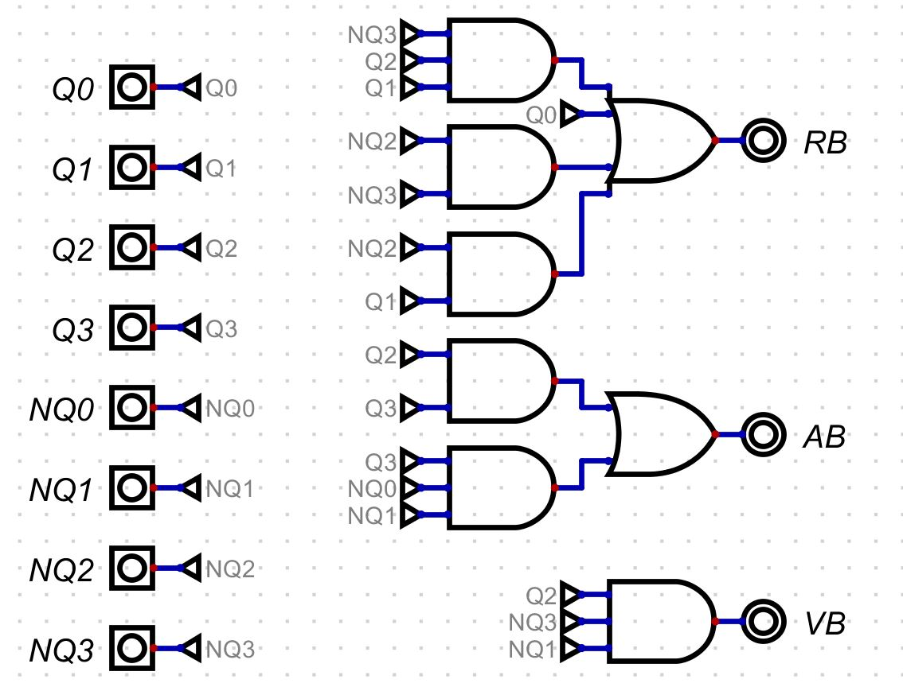

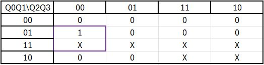

$$VC=Q1\bar{Q2}\bar{Q3}$$

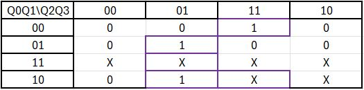

$$AC=Q1 \bar{Q2} Q3+Q0 \bar{Q2} Q3+\bar{Q1} Q2Q3$$

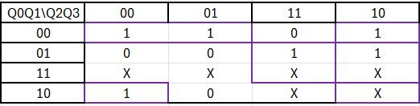

$$RC=Q2\bar{Q3}+Q1Q2+\bar{Q0}+\bar{Q1}+\bar{Q2}+Q0\bar{Q1}\bar{Q3}$$


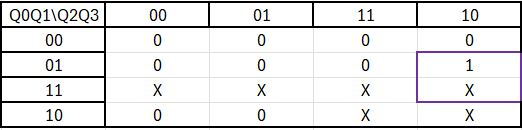

$$VD=Q2\bar{Q3} Q1$$

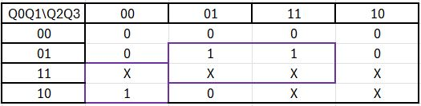

$$AD=\bar{Q2}\bar{Q3} Q0+Q3Q1$$

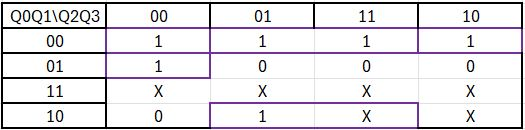

$$RD=\bar{Q2}\bar{Q3}\bar{Q0}+Q3\bar{Q1}+\bar{Q0}\bar{Q1}$$

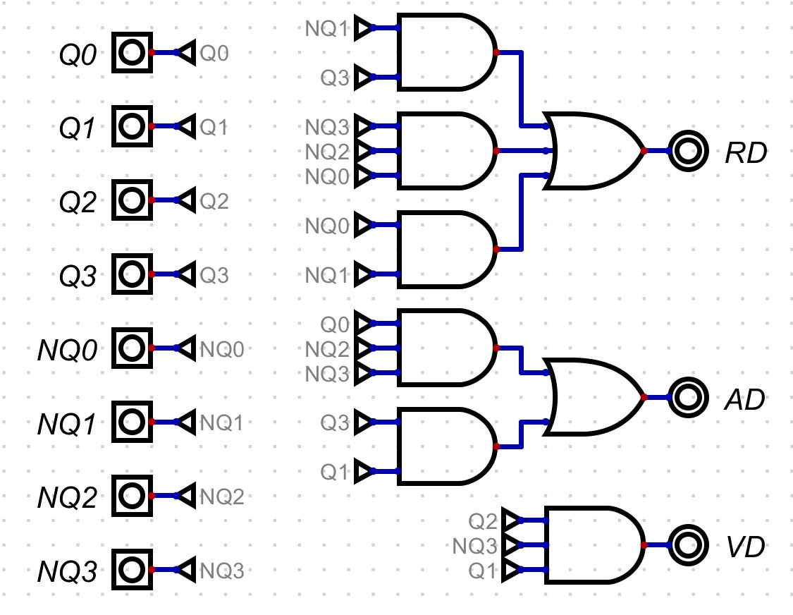

### Codificación a BCD y 7 segmentos

El proyecto contará con una cabina de mando donde se mostrará el número de vehículos en cada intersección. La situación es la siguiente: se tiene un número binario de 6 bits, proporcionado por el modulo contador, con una capacidad máxima de 63 vehículos. Será necesario convertir este número a BCD y, posteriormente, a una representación en display de 7 segmentos.

La conversión a BCD se realizará con el siguiente código en Verilog, el cual, mediante un bucle for, comparará constantemente el número de entrada con 10. Si el número es mayor, se le restarán 10 unidades y el proceso se repetirá. De lo contrario, el bucle finalizará. De esta forma, se determinará cuántas veces se puede restar 10 al valor original para obtener el dígito de las decenas. Finalmente, el residuo tras restar 10 repetidamente (hasta que sea menor que 10) corresponderá al dígito de las unidades.

```verilog
module div (
    input [5:0] NUM,   // Número binario de 6 bits (0 a 63)
    output reg A0, // Bit más significativo del primer dígito (decenas)
    output reg B0, // Bit 2 del primer dígito
    output reg C0, // Bit 1 del primer dígito
    output reg D0, // Bit menos significativo del primer dígito (decenas)
    output reg A1, // Bit más significativo del segundo dígito (unidades)
    output reg B1, // Bit 2 del segundo dígito
    output reg C1, // Bit 1 del segundo dígito
    output reg D1  // Bit menos significativo del segundo dígito (unidades)
);
    integer i;
    reg [5:0] temp;
    reg [3:0] dec_tens;
    reg [3:0] dec_ones;
    
    always @(*) begin
        temp = NUM;
        dec_tens = 4'b0000;
        dec_ones = 4'b0000;
        
        // Restar 10 hasta que el número sea menor que 10
        for (i = 0; i < 6; i = i + 1) begin
            if (temp >= 10) begin
                temp = temp - 10;
                dec_tens = dec_tens + 4'b0001;
            end
        end
        
        // Lo que queda es el dígito de unidades
        dec_ones = temp[3:0];
        
        {A0, B0, C0, D0} = dec_tens;
        {A1, B1, C1, D1} = dec_ones;
    end
endmodule
```
Luego de obtener dicho número, se procede a transformarlo para su visualización en un display de 7 segmentos. Para ello, es necesario obtener las ecuaciones del circuito e implementarlas en el programa digital. Debido a la amplia utilización de este tipo de displays, dichas ecuaciones pueden encontrarse en diversas fuentes. En este caso, se implementarán según la referencia número [1].


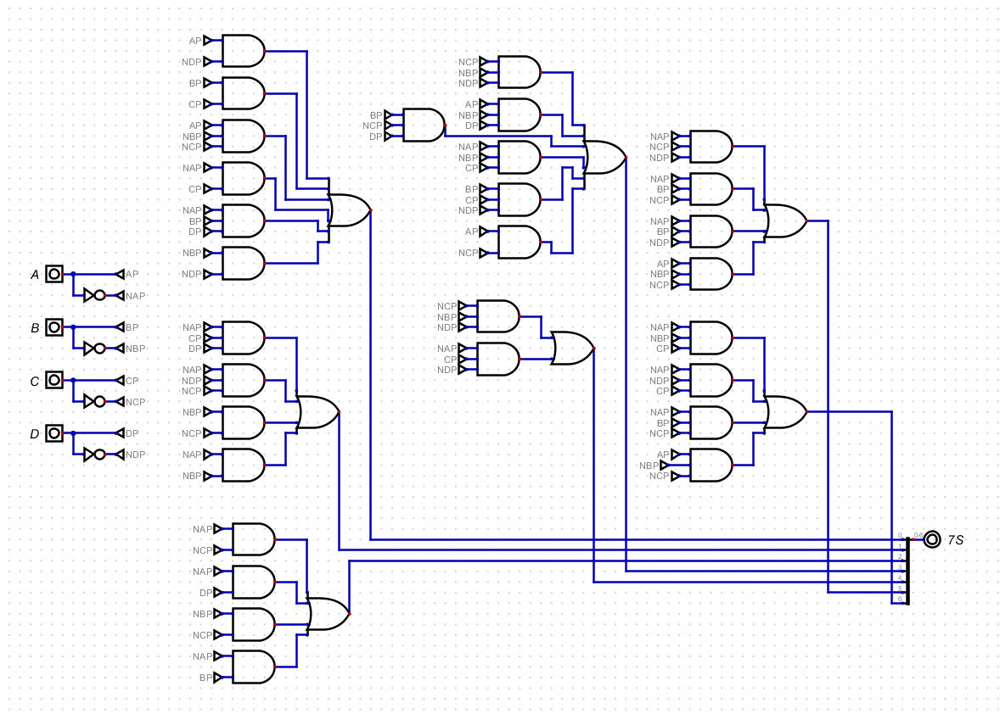


### Divisores de frecuencia

La FPGA utilizada cuenta con un clock integrado de 25 MHz, por lo que es necesario generar una señal de reloj adecuada para el control de los semáforos. Siguiendo la convención establecida, los tiempos de simulación serán de 10 segundos en verde y 2 segundos en amarillo, antes de cambiar a rojo. Para lograr esto, se implementará un divisor de frecuencia mediante el siguiente código en Verilog, el cual, básicamente, toma la señal de entrada de 25 MHz y la divide a una frecuencia más baja. El proceso se realiza utilizando un contador que se incrementa en cada flanco positivo del reloj de entrada. Cuando el contador alcanza el valor máximo calculado, que se obtiene dividiendo la frecuencia de entrada entre la de salida, el contador se reinicia y se invierte la señal de salida, logrando así la reducción de la frecuencia. Este proceso permite generar una señal de reloj con una frecuencia adecuada para los semáforos.

```verilog
module divFreq #(
  parameter integer FREQ_IN = 25000000,
  parameter integer FREQ_OUT = 1,
  parameter integer INIT = 0
) (
    // Inputs and output ports
    input CLK_IN,
    output reg CLK_OUT = 0
);

  localparam integer COUNT = (FREQ_IN / FREQ_OUT) / 2;
  localparam integer SIZE = $clog2(COUNT);
  localparam integer LIMIT = COUNT - 1;

  // Declaración de señales [reg, wire]
  reg [SIZE-1:0] count = INIT;

  // Descripción del comportamiento
  always @(posedge CLK_IN) begin
    if (count == LIMIT) begin
      count   <= 0;
      CLK_OUT <= ~CLK_OUT;
    end else begin
      count <= count + 1;
    end
  end
endmodule
```

## Sintesis FPGA

Luego de crear el circuito en el programa Digital, se exporta a lenguaje Verilog utilizando la opción disponible en este programa. A continuación, se añaden los divisores de frecuencia correspondientes y, finalmente, se implementa el código previamente mostrado para convertir el número binario a BCD, ya que esta conversión no fue posible realizarla en el programa Digital. El circuito sintonizado en la FPGA es:


## Referencias

[1]“Laboratorios fundamentos circuitos digitales: práctica #5,” Laboratorios Fundamentos Circuitos Digitales. https://blogfundamentoscircuitosdigitales.blogspot.com/p/practica-5.html


 


