# Semáforo inteligente

| Electrónica Digital I | Grupo 4 | Equipo 3 |
|------------------------|---------|----------|

- Nicolás Garzón Peña
- José Alejandro López Vargas
- Johan Stiven Tovar López
___

## Objetivo

- Diseñar e implementar un sistema de semáforos inteligentes que sea funcional para intersecciones donde el flujo vehicular sea similar en cada calle, como, por ejemplo, la intersección que comprende la Avenida Las Américas y la Carrera 37.
- Se busca que el diseño considere la cantidad de flujo vehicular y, de esta forma, mejore los tiempos de espera generales en este tipo de intersecciones. Además, se busca que el diseño siga un análisis Top-Down.

## Introducción

En muchas ciudades del mundo, los problemas de movilidad generan pérdidas de tiempo, molestias y malestares para los usuarios. En particular, en la capital de nuestro país, la congestión vehicular en horas pico dificulta la circulación y reduce la eficiencia del transporte.

Para abordar este problema, se propone la implementación de un sistema de semáforos inteligentes capaces de contabilizar, en tiempo real, la cantidad de vehículos en cada vía de una intersección. Mediante un sistema de codificación digital, estos semáforos priorizarían el paso en las calles con mayor congestión, ajustando los tiempos de espera de manera dinámica y sincronizada. Este proceso se repetiría continuamente, optimizando el flujo vehicular y reduciendo el tiempo perdido en el tráfico.


## Diseño

Para este proyecto vamos diseñar un circuito que maneje los semáforos de una intersección de 2 calles en doble sentido en función del tráfico de cada una; teniendo un total de 4 semáforos, que llamaremos semáforo A, B, C, D.

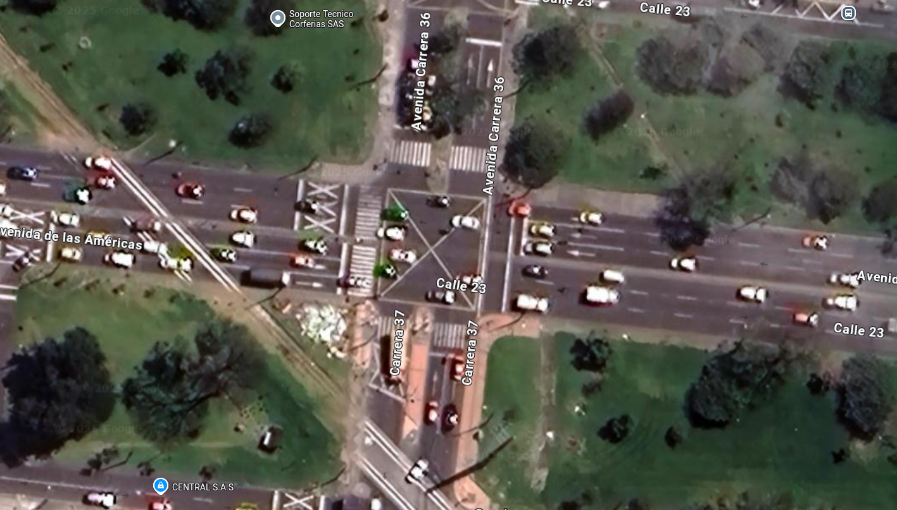


### Entradas y salidas

Las entradas constarán de un par de sensores que medirán tanto el tráfico que entra como el tráfico que sale, que llamaremos Xp y Xl respectivamente, para un total de 8 entradas. Las salidas serán la iluminación del semáforo (Rojo, amarillo o verde), que llamaremos RX, AX y VX, para un total de 12 salidas.


### Diagrama de bloques

El proyecto lo definimos en distintas etapas. Primeramente, las señales de entrada deberán pasar por un contador que sume los carros que entran a la calle y reste los carros que salgan de la misma. Después, necesitamos saber cúal es la calle con más tráfico, por lo que la señal de los contadores pasará por un comparador que determine cúal es la calle con más tráfico. Una vez definido el estado actual del tráfico, una máquina de estados decide cúal es el estado siguiente que los semáforos deben tomar. Finalmente, según las salidas de la máquina de estados, cada semáforo tiene su propia lógica que establece que luz se debe prender.


### Contador

Vamos a trabajar con un contador de 6 bits, de esta manera se puede contar tráfico del 0 al 63.


La entrada y salida del tráfico la simulamos con 2 pulsadores, "+" y "-" respectivamente; así mismo las entradas "++" y "--" cumplen la misma función pero se conectan con una señal reloj adicional para subir o bajar más rápido el contador, aunque no tienen niguna aplicación real. Los valores de los contadores se restan para sacar el tráfico total y con ello obtenemos la salida "Num" que es el número de 6 bits. Adicional a esto tenemos 2 circuitos combinacionales que tienen como salida "L" y "M", los cuales activan o desactivan la función enable de los contadores. La "L" impide que el número pase de 63 a 0 y la "M" impide que el número pase de 0 a 63.

### Comparador 


El comparador tiene 4 entradas de 6 bits, que corresponde al tráfico de cada semáforo y son NA, NB, NC, ND; y 4 salidas de 1 bit TA, TB, TC y TD que representarán cuál es el semáforo con mayor tráfico. Para definir el número mayor se emparejan los números en NA - NB, y NC - ND y se comparan, los dos números mayores pasan a un nuevo comparador y con esto ya sabemos cúal es el número mayor. Además de esto, hay una serie de compuertas lógicas y multiplexores que definen las salidas. Una aclaración con este circuito es ¿qué pasaría si dos o más semáforos tienen el mismo tráfico?, en este caso se escogió de manera arbitraria la siguiente jerarquía:

1. Tráfico A
2. Tráfico B
3. Tráfico C
4. Tráfico D

Lo que quiere decir que el semáforo A tiene mayor prioridad y el semáforo D el de menor prioridad en caso de tener dos o más calles con el mismo tráfico.

### Máquina de estados 
La máquina de estados tendrá 4 de entradas de 1 bit que son TA, TB, TC y TD que representan el estado presente, a partir de esto definimos los distintos estados que puede tomar la máquina.

#### Estados

De manera intuitiva se podría pensar que los estados de la máquina son todas las posibles combinaciones que pueden haber entre las luces de los semáforos, sin embargo esto no es cierto, ya que hay una restricción de que solo puede haber un semáforo en verde a la vez; así que en base a esto definimos nuestros 4 primero estados:

1. Semáforo A en verde y B, C, D en rojo (E0)
2. Semáforo B en verde y A, C, D en rojo (E2)
3. Semáforo C en verde y A, B. D en rojo (E4)
4. Semáforo D en verde y A, B, C en rojo (E6)

 Con esto nos percatamos que los estados restantes corresponden a la transición entre cada uno de los 4 estados, siendo los siguientes:

5. Semáforo A y B en amarillo y C y D en rojo (E1)
6. Semáforo A y C en amarillo y B y D en rojo (E9)
7. Semáforo A y D en amarillo y B y C en rojo (E8)
8. Semáforo B y C en amarillo y A y D en rojo (E3)
9. Semáforo B y D en amarillo y A y C en rojo (E7)
10. Semáforo C y D en amarillo y A y B en rojo (E5)

Obteniendo un total de 10 estados

#### Transición de estados

Empezamos por el diagrama de transición de estados


Para codificar los estados vamos a usar binario obteniendo la siguiente tabla


Con base a la codificación nos damos cuenta de que necesitamos 4 Flip-Flops para nuestra máquina de estados

Con esto ya podemos armar nuestra tabla de transición de estados


Las ecuaciones de $Q0'\; Q1'\;  Q2'\; Q3'$ las obtenemos a partir de la suma de productos (SoP), también tenemos en cuenta la tabla de transición y la tabla de excitación de los diferentes Flip-Flop; y se determinó que los Flip-Flop que generan ecuaciones con menos términos, son Flip-Flop tipo D para $Q0' \; Q3'$ y Flip-Flop tipo JK para $Q1' \; Q2'$. De manera que obtenemos la siguiente tabla.


La ecuaciones que obtenemos son las siguientes

$$
\begin{align}
D0=(TC+TD)\cdot \bar{Q0}\bar{Q1}\bar{Q2}\bar{Q3}+TA\cdot(\bar{Q0} Q1 \bar{Q2}\bar{Q3} + \bar{Q0} Q1Q2 \bar{Q3})\\
J1=TD\cdot (\bar{Q0}\bar{Q1} Q2 \bar{Q3} + Q0 \bar{Q1}\bar{Q2}\bar{Q3})+TC\cdot (\bar{Q0}\bar{Q1} Q2 Q3 + Q0 \bar{Q1}\bar{Q2} Q3\\
K1=(TA+TB) \cdot (\bar{Q0} Q1 \bar{Q2}\bar{Q3})+TA\cdot (\bar{Q0} Q1 Q2 \bar{Q3})+TB\cdot (\bar{Q0} Q1Q2Q3)\\
J2=TB\cdot (\bar{Q0} Q1 \bar{Q2}\bar{Q3} + \bar{Q0}\bar{Q1}\bar{Q2} Q3) + TD\cdot (\bar{Q0} Q1 \bar{Q2} Q3 + Q0 \bar{Q1}\bar{Q2}\bar{Q3})\\
K2=(TA+TC)\cdot (\bar{Q0} Q1Q2 \bar{Q3}) +TA\cdot (\bar{Q0}\bar{Q1} Q2 \bar{Q3})+ TC\cdot (\bar{Q0}\bar{Q1} Q2Q3)\\
D3=(TB+TC)\cdot (\bar{Q0}\bar{Q1}\bar{Q2}\bar{Q3})+(TA+TC+TD)\cdot (\bar{Q0}\bar{Q1}Q2 \bar{Q3})+(TA+TB+TD)\cdot (\bar{Q0} Q1 \bar{Q2}\bar{Q3})+(TB+TC)\cdot (\bar{Q0} Q1Q2 \bar{Q3})
\end{align}
$$

Obteniendo el siguiente circuito


### Salidas

Planteamos la tabla de salidas


Planteamos la tabla de Karnaugh de cada salida para hallar su circuito

#### Semáforo A


$$VA=\bar{Q0}\bar{Q1}\bar{Q2}\bar{Q3}$$


$$AA=Q0+\bar{Q1}\bar{Q2}Q3$$


$$RA=Q1+Q2$$


#### Semáforo B


$$VB=\bar{Q1} Q2 \bar{Q3}$$


$$AB=Q2Q3+\bar{Q0}\bar{Q1} Q3$$


$$RB=Q0+\bar{Q2}\bar{Q3}+Q1Q2\bar{Q3}+Q1\bar{Q2}$$


#### Semáforo C


$$VC=Q1\bar{Q2}\bar{Q3}$$


$$AC=Q1 \bar{Q2} Q3+Q0 \bar{Q2} Q3+\bar{Q1} Q2Q3$$


$$RC=Q2\bar{Q3}+Q1Q2+\bar{Q0}+\bar{Q1}+\bar{Q2}+Q0\bar{Q1}\bar{Q3}$$


#### Semáforo D


$$VD=Q2\bar{Q3} Q1$$


$$AD=\bar{Q2}\bar{Q3} Q0+Q3Q1$$


$$RD=\bar{Q2}\bar{Q3}\bar{Q0}+Q3\bar{Q1}+\bar{Q0}\bar{Q1}$$


### Codificación a BCD y 7 segmentos

El proyecto contará con una cabina de mando donde se mostrará el número de vehículos en cada intersección. La situación es la siguiente: se tiene un número binario de 6 bits, proporcionado por el modulo contador, con una capacidad máxima de 63 vehículos. Será necesario convertir este número a BCD y, posteriormente, a una representación en display de 7 segmentos.

La conversión a BCD se realizará con el siguiente código en Verilog, el cual, mediante un bucle for, comparará constantemente el número de entrada con 10. Si el número es mayor, se le restarán 10 unidades y el proceso se repetirá. De lo contrario, el bucle finalizará. De esta forma, se determinará cuántas veces se puede restar 10 al valor original para obtener el dígito de las decenas. Finalmente, el residuo tras restar 10 repetidamente (hasta que sea menor que 10) corresponderá al dígito de las unidades.

```verilog
module div (
    input [5:0] NUM,   // Número binario de 6 bits (0 a 63)
    output reg A0, // Bit más significativo del primer dígito (decenas)
    output reg B0, // Bit 2 del primer dígito
    output reg C0, // Bit 1 del primer dígito
    output reg D0, // Bit menos significativo del primer dígito (decenas)
    output reg A1, // Bit más significativo del segundo dígito (unidades)
    output reg B1, // Bit 2 del segundo dígito
    output reg C1, // Bit 1 del segundo dígito
    output reg D1  // Bit menos significativo del segundo dígito (unidades)
);
    integer i;
    reg [5:0] temp;
    reg [3:0] dec_tens;
    reg [3:0] dec_ones;
    
    always @(*) begin
        temp = NUM;
        dec_tens = 4'b0000;
        dec_ones = 4'b0000;
        
        // Restar 10 hasta que el número sea menor que 10
        for (i = 0; i < 6; i = i + 1) begin
            if (temp >= 10) begin
                temp = temp - 10;
                dec_tens = dec_tens + 4'b0001;
            end
        end
        
        // Lo que queda es el dígito de unidades
        dec_ones = temp[3:0];
        
        {A0, B0, C0, D0} = dec_tens;
        {A1, B1, C1, D1} = dec_ones;
    end
endmodule
```
Luego de obtener dicho número, se procede a transformarlo para su visualización en un display de 7 segmentos. Para ello, es necesario obtener las ecuaciones del circuito e implementarlas en el programa digital. Debido a la amplia utilización de este tipo de displays, dichas ecuaciones pueden encontrarse en diversas fuentes. En este caso, se implementarán según la referencia número [1].


### Multiplexor

La idea de multiplexar los 7 segmentos es que todos los diplay reciban la misma entrada pero solo el display de la entrada correspondiente se prenda, para ello los enable de cada display deben ir variando rápidamente al mismo tiempo que el número en la entrada va variando. Para cambiar el estado de los enable se utiliza una máquina de estados sin entradas que varía de un estado a otro en bucle, en este caso tenemos 8 enable´s por lo que usamos 3 Flip-Flop y codificamos con tres dígitos.

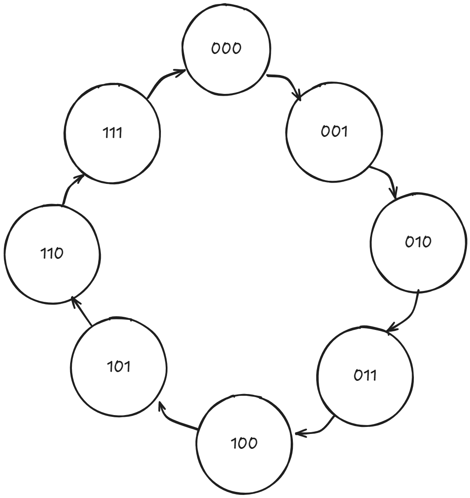

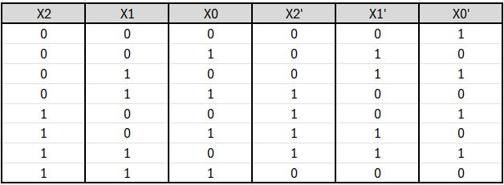

Utilizando Flip-Flop tipo D podemos usar directamente la tabla de Karnaugh para hallar las ecuaciones del estado futuro

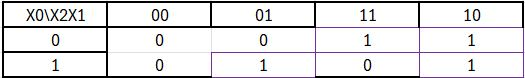

$$X'_2=\bar{X_0}X_2+X_2\bar{X_1}+X_0\bar{X_2}X_1$$

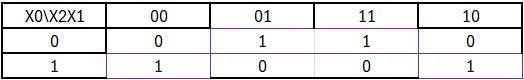

$$X'_1=X_0\bar{X_1}+\bar{X_0}X_1=X_1\oplus X_0$$

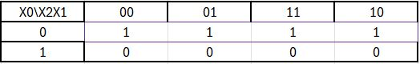

$$X'_0=\bar{X_0}$$

Finalmente para las salidas utilizamos el producto de sumas (PoS) basándonos en la siguiente tabla

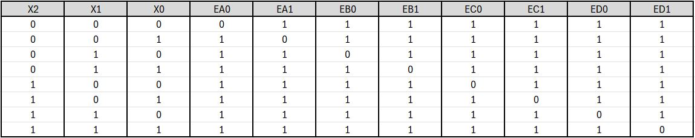

Obteniendo el siguiente circuito

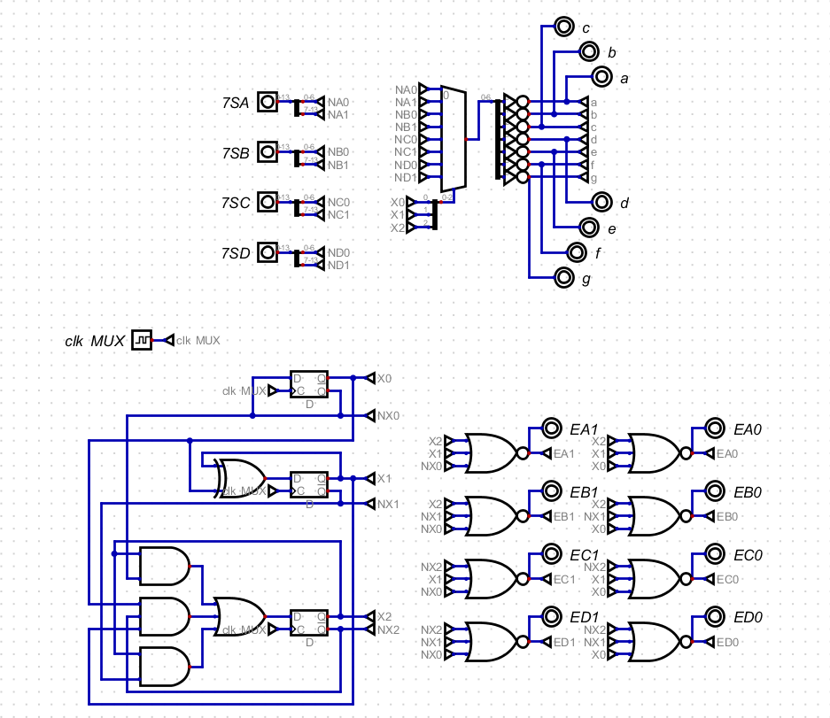

Notamos que las salidas están negadas, esto se debe a que el circuito se diseño para un display cátodo común pero al final se usó un display ánodo común.

### Divisores de frecuencia

La FPGA utilizada cuenta con un clock integrado de 25 MHz, por lo que es necesario generar una señal de reloj adecuada para el control de los semáforos. Siguiendo la convención establecida, los tiempos de simulación serán de 10 segundos en verde y 2 segundos en amarillo, antes de cambiar a rojo. Para lograr esto, se implementará un divisor de frecuencia mediante el siguiente código en Verilog, el cual, básicamente, toma la señal de entrada de 25 MHz y la divide a una frecuencia más baja. El proceso se realiza utilizando un contador que se incrementa en cada flanco positivo del reloj de entrada. Cuando el contador alcanza el valor máximo calculado, que se obtiene dividiendo la frecuencia de entrada entre la de salida, el contador se reinicia y se invierte la señal de salida, logrando así la reducción de la frecuencia. Este proceso permite generar una señal de reloj con una frecuencia adecuada para los semáforos.

```verilog
module divFreq #(
  parameter integer FREQ_IN = 25000000,
  parameter integer FREQ_OUT = 1,
  parameter integer INIT = 0
) (
    // Inputs and output ports
    input CLK_IN,
    output reg CLK_OUT = 0
);

  localparam integer COUNT = (FREQ_IN / FREQ_OUT) / 2;
  localparam integer SIZE = $clog2(COUNT);
  localparam integer LIMIT = COUNT - 1;

  // Declaración de señales [reg, wire]
  reg [SIZE-1:0] count = INIT;

  // Descripción del comportamiento
  always @(posedge CLK_IN) begin
    if (count == LIMIT) begin
      count   <= 0;
      CLK_OUT <= ~CLK_OUT;
    end else begin
      count <= count + 1;
    end
  end
endmodule
```

### Circuito final 

Finalmente el circuito con todos los bloques integrados queda de de la siguiente manera

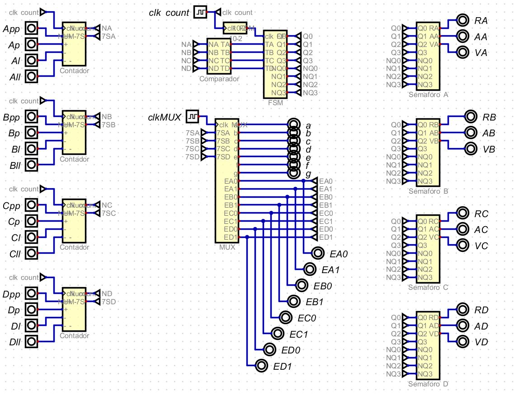

### Pantalla LCD

En etapas avanzadas del proyecto, se decidió reemplazar los BCD de 7 segmentos por una pantalla LCD 1602A 16x2 sin I²C. Esta transición no presentó demasiadas dificultades, ya que el número de carros en cada intersección ya se había descompuesto en unidades y decenas. Por lo tanto, el único elemento faltante era convertirlo a código ASCII.

Posteriormente, se muestra el texto "SmfA:__", lo que indica la cantidad de carros en el semáforo A. A su vez, fue necesario implementar otro divisor de frecuencia para la máquina de estados correspondiente, debido a la necesidad de enviar diversos comandos a la pantalla en cada momento, como pasar a la segunda fila, limpiar la pantalla, encender la pantalla, etc.

Finalmente, el módulo implementado es el siguiente:

```verilog
module LCD(
    input clk,
    output reg rs,
    output reg en,
    output reg rw,
    output reg [7:0] dat,
    input [3:0] AD, //4 Bits decenas de A
    input [3:0] AU, //4 Bits Unidades de A
    input [3:0] BD, //4 Bits decenas de B
    input [3:0] BU, //4 Bits Unidades de B
    input [3:0] CD, //4 Bits decenas de C
    input [3:0] CU, //4 Bits Unidades de C
    input [3:0] DD, //4 Bits decenas de D
    input [3:0] DU //4 Bits Unidades de D
);

    reg [15:0] counter;
    reg [5:0] current, next;
    reg clkR;

    // Registros para almacenar los valores ASCII
    reg [7:0] A1_ascii, A0_ascii, B1_ascii, B0_ascii, C1_ascii, C0_ascii, D1_ascii, D0_ascii;

    // Función para convertir binario a ASCII
    function [7:0] bin_to_ascii;
        input [3:0] bin;
        begin
            if (bin <= 4'b1001) // 0-9
                bin_to_ascii = 8'h30 + bin;
            else // A-F
                bin_to_ascii = 8'h41 + (bin - 4'b1010);
        end
    endfunction

    initial begin
        dat = 0;
        rs = 0;
        counter = 0;
        current = 0;
        next = 0;
        clkR = 0;
    end

    always @(posedge clk) begin
        counter = counter + 1;
        if (counter == 16'hFFFF) clkR = ~clkR;
    end

    always @(posedge clkR) begin
        // Convertir los valores binarios a ASCII
        A1_ascii = bin_to_ascii({3'b000, AD});
        A0_ascii = bin_to_ascii({3'b000, AU});
        B1_ascii = bin_to_ascii({3'b000, BD});
        B0_ascii = bin_to_ascii({3'b000, BU});
        C1_ascii = bin_to_ascii({3'b000, CD});
        C0_ascii = bin_to_ascii({3'b000, CU});
        D1_ascii = bin_to_ascii({3'b000, DD});
        D0_ascii = bin_to_ascii({3'b000, DU});

        current = next;
        case (current)
            0:  begin rs <= 0; dat <= 8'h38; next <= 1; end // Config 8bit
            1:  begin rs <= 0; dat <= 8'h38; next <= 2; end 
            2:  begin rs <= 0; dat <= 8'h0E; next <= 4; end 
            3:  begin rs <= 0; dat <= 8'h01; next <= 4; end 
            
            // Fila 1
            4:  begin rs <= 0; dat <= 8'h80; next <= 5; end
            5:  begin rs <= 1; dat <= 8'h53; next <= 6; end // S
            6:  begin rs <= 1; dat <= 8'h6D; next <= 7; end // m
            7:  begin rs <= 1; dat <= 8'h66; next <= 8; end // f
            8:  begin rs <= 1; dat <= 8'h41; next <= 9; end // A
            9:  begin rs <= 1; dat <= 8'h3A; next <= 10; end // :
            10: begin rs <= 1; dat <= A1_ascii; next <= 11; end // A1 en hexadecimal
            11: begin rs <= 1; dat <= A0_ascii; next <= 12; end // A0 en hexadecimal
            12: begin rs <= 1; dat <= 8'h20; next <= 13; end // Espacio
            13: begin rs <= 1; dat <= 8'h53; next <= 14; end // S
            14: begin rs <= 1; dat <= 8'h6D; next <= 15; end // m
            15: begin rs <= 1; dat <= 8'h66; next <= 16; end // f
            16: begin rs <= 1; dat <= 8'h42; next <= 17; end // B
            17: begin rs <= 1; dat <= 8'h3A; next <= 18; end // :
            18: begin rs <= 1; dat <= B1_ascii; next <= 19; end // B1 en hexadecimal
            19: begin rs <= 1; dat <= B0_ascii; next <= 20; end // B0 en hexadecimal
            
            // Fila 2
            20: begin rs <= 0; dat <= 8'hC0; next <= 21; end
            21: begin rs <= 1; dat <= 8'h53; next <= 22; end // S
            22: begin rs <= 1; dat <= 8'h6D; next <= 23; end // m
            23: begin rs <= 1; dat <= 8'h66; next <= 24; end // f
            24: begin rs <= 1; dat <= 8'h43; next <= 25; end // C
            25: begin rs <= 1; dat <= 8'h3A; next <= 26; end // :
            26: begin rs <= 1; dat <= C1_ascii; next <= 27; end // C1 en hexadecimal
            27: begin rs <= 1; dat <= C0_ascii; next <= 28; end // C0 en hexadecimal
            28: begin rs <= 1; dat <= 8'h20; next <= 29; end // Espacio
            29: begin rs <= 1; dat <= 8'h53; next <= 30; end // S
            30: begin rs <= 1; dat <= 8'h6D; next <= 31; end // m
            31: begin rs <= 1; dat <= 8'h66; next <= 32; end // f
            32: begin rs <= 1; dat <= 8'h44; next <= 33; end // D
            33: begin rs <= 1; dat <= 8'h3A; next <= 34; end // :
            34: begin rs <= 1; dat <= D1_ascii; next <= 35; end // D1 en hexadecimal
            35: begin rs <= 1; dat <= D0_ascii; next <= 0; end // D0 en hexadecimal
            default: next = 0;
        endcase
    end

    assign en = clkR;
    assign rw = 0;
endmodule
```


## Sintesis FPGA

Luego de crear el circuito en el programa Digital, se exporta a lenguaje Verilog utilizando la opción disponible en este programa. A continuación, se añaden los divisores de frecuencia correspondientes y, finalmente, se implementa el código previamente mostrado para convertir el número binario a BCD, ya que esta conversión no fue posible realizarla en el programa Digital. El circuito sintonizado en la FPGA es el siguiente, donde la entrada hclk corresponde al clock de 25Mhz integrado en la FPGA:

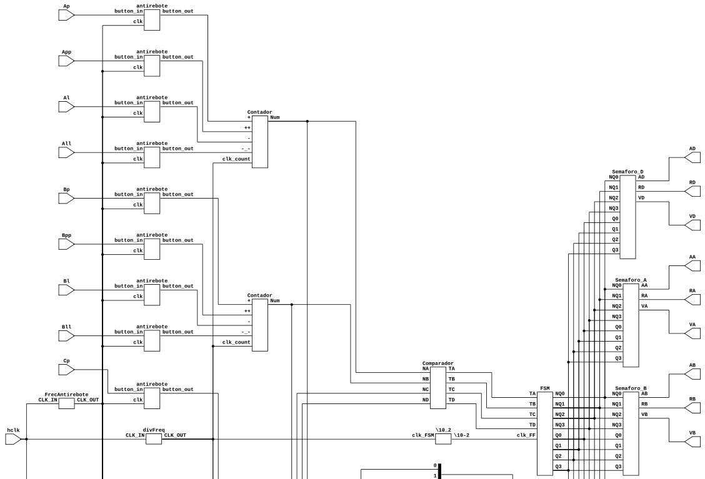


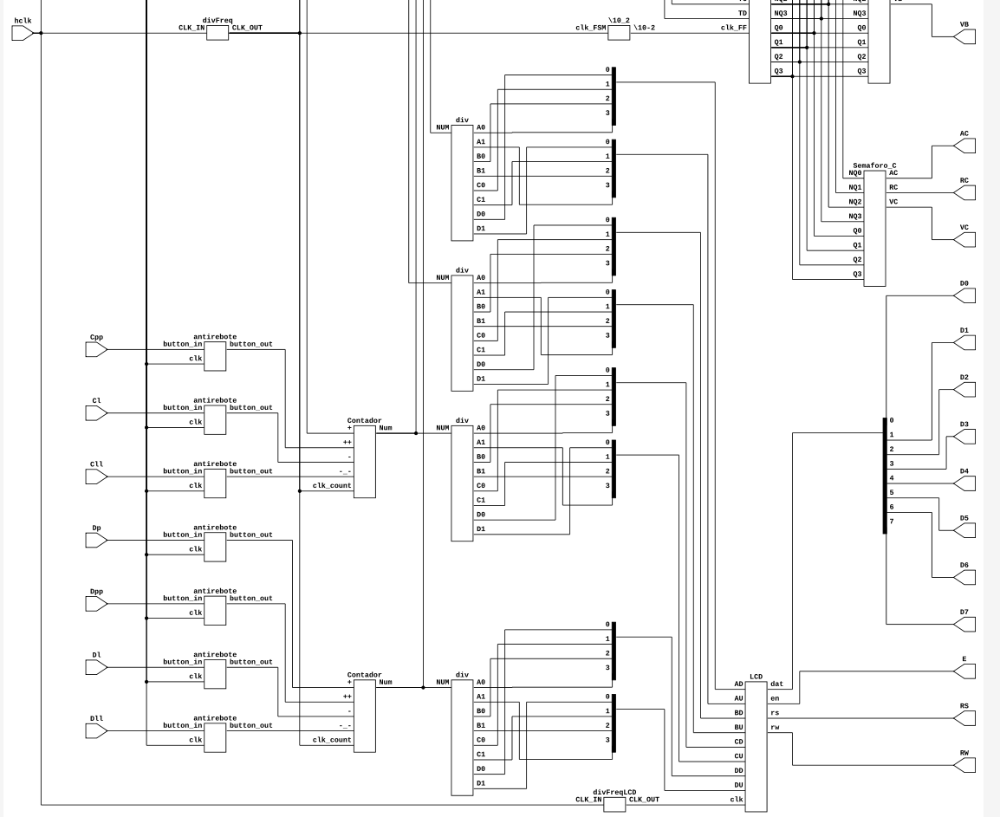

## Recursos utilizados

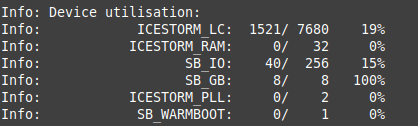


#### 1. ICESTORM LC (Logic Cells)
   - **1521 / 7680 (19%)**  
   - Indica el número de celdas lógicas (Logic Cells, LC) utilizadas sobre el total disponible en la FPGA (iCE40 HX4K en este caso).  
   - 1521 celdas están en uso de un total de 7680, lo que representa un 19% de uso.

#### 2. ICESTORM RAM
   - **8 / 32 (25%)**  
   - Indica la cantidad de bloques de memoria RAM en uso. La FPGA tiene 32 bloques disponibles, en este caso se utiliza un 25%.

#### 3. SB IO (Special Function Block I/O)
   - **40 / 256 (15%)**  
   - Muestra la cantidad de pines de entrada/salida (I/O) usados sobre el total disponible.  
   - En este caso, 40 pines están en uso de un total de 256.

#### 4. SB GB (Special Function Block Global Buffers)
   - **8 / 8 (100%)**  
   - Representa los buffers globales disponibles y en uso. Estos se utilizan para distribuir señales de reloj u otras señales críticas en toda la FPGA.  
   - Aquí se están utilizando todos los buffers globales disponibles (100%).

#### 5. ICESTORM PLL (Phase-Locked Loop)
   - **0 / 2 (0%)**  
   - Indica cuántos de los PLL (circuitos de bloqueo de fase) están en uso.  
   - En este caso, no estás utilizando ninguno de los dos PLL disponibles.

#### 6. SB WARMBOOT
   - **0 / 1 (0%)**  
   - Indica si se está utilizando el módulo de "Warm Boot", que permite reiniciar la FPGA desde otra configuración sin apagarla.  
   - En este caso, no se está usando.


 ### Cronograma (Avances)
Tras 12 semanas de trabajo, se ha logrado cumplir con los objetivos establecidos en las primeras seis semanas. En este tiempo, se definió el comportamiento de los semáforos mediante tablas de verdad, cuyos resultados fueron traducidos a un modelo lógico y validados a través de una implementación física. Posteriormente, se integraron los pulsadores como entradas físicas del sistema, junto con la implementación de los displays BCD y los contadores para visualizar el número de vehículos en cada calle de la intersección planteada. Finalmente, se realizaron pruebas en la FPGA para verificar el comportamiento del sistema en todos los escenarios posibles. Con esto, se ha finalizado el diseño lógico del proyecto.

Como variación respecto a la planificación inicial, se decidió sustituir el desarrollo de una PCB por el uso de baquelas, lo que permitirá construir una maqueta más comprensible para los espectadores ajenos al proyecto. Por lo tanto, las tareas inicialmente programadas para las semanas 7, 8, 9 y 10 serán desarrolladas en las semanas finales previas a la presentación del proyecto en el formato "DESAFÍO" propuesto por el profesor.

## Dificultades

### Planteamiento Lógico Inicial
En las primeras etapas del desarrollo del proyecto, surgieron dificultades en el diseño, especialmente al definir el planteamiento del problema y establecer el comportamiento básico del sistema mediante los métodos vistos en clase. También se presentaron retos en la elaboración de diagramas clave, como la máquina de estados y los flip-flops, necesarios para comprender el funcionamiento del sistema.

### Implementación Lógica en FPGA
Uno de los principales inconvenientes fue la traducción del diseño al lenguaje de programación compatible con la FPGA. El desconocimiento del lenguaje Verilog dificultó significativamente el avance del proyecto y el cumplimiento de los objetivos establecidos en el cronograma. Además, el diseño del codificador de BCD a 7 segmentos presentó complicaciones por las mismas razones, lo que requirió un mayor esfuerzo en la fase de implementación.

### Clock
Para la lógica de los displays, era necesario un clock que actualizara los datos en función de los pulsadores de aumento o disminución del número de vehículos. La dificultad principal fue la necesidad de reducir la frecuencia del clock para adaptarla a los requerimientos del sistema. Esta problemática se resolvió mediante la implementación de un divisor de frecuencia.

### Pulsadores con Antirebote

En etapas avanzadas de prueba del proyecto surgió una problemática. Los pulsadores eran demasiado sensibles y generaban multitud de pulsos, lo cual no se quería en este caso. Así que se indagó en la solución de este problema y se decidió incorporar un mecanismo denominado antirrebote. Esto se podía realizar físicamente en el circuito con un condensador, pero decidimos explorar la opción con software, la cual incorpora el módulo antirrebote al código Verilog.

## Conclusiones

- La división de las funciones del proyecto (diagrama de bloques) y la metodología Top-Down agilizó la simulación y construcción del proyecto, junto a una certera verificación de su correcto funcionamiento.
- Es necesario un estudio previo sobre el tráfico de la zona en donde se quiera implementar el proyecto, ya que para nuestro caso, el número de vehículos que se pueden contar se ve limitado por el número de bits que utiliza el crcuito; por lo que se debe ajustar el número de bits que se quieran usar para tener suficientes como para contar todo el tráfico sin tener un gran excedente.
- En resumen, se han podido cumplir los objetivos planteados en un inicio a pesar de todas las dificultades. La FPGA ha demostrado ser de gran utilidad en el manejo y control de lógica combinacional y secuencial, ya que con esta se ha podido plantear una posible solución a un problema real, mostrando así el gran aporte que puede dar la electrónica digital en situaciones prácticas.

## Trabajos futuros

Dentro de las potenciales optimizaciones y expansiones que puede tener el proyecto consideramos las siguientes:

- **Implementación de sensores físicos:**  Nuestro proyecto el conteo del tráfico funciona mediante pulsadores, una clara mejora sería la incorporación de sensores físicos, que pueden variar desde sensores de presión en el asfalto, hasta cámaras con procesamiento de imágenes; la solución puede variar según el contexto en el que se encuentre.
- **Expansión a múltiples intersecciones:** En cuanto a la expansión del proyecto se propone emplear el sistema en varias intersecciones y que a su vez estas estén interconectadas de alguna manera para lograr una mejor optimización del tráfico.

## Referencias

[1]“Laboratorios fundamentos circuitos digitales: práctica #5,” Laboratorios Fundamentos Circuitos Digitales. https://blogfundamentoscircuitosdigitales.blogspot.com/p/practica-5.html

[2] David Harris & Sarah Harris, Digital design and computer architecture, Morgan Kauffman, 2004


 


